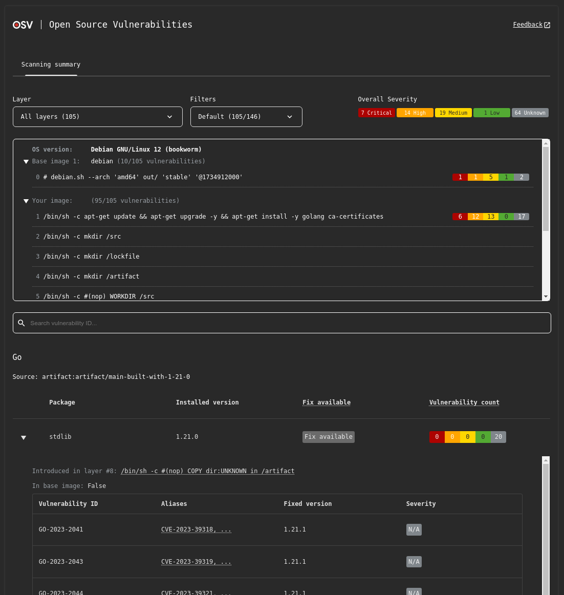

# v2.1.0

### Features:

- [Feature #2038](https://github.com/google/osv-scanner/pull/2038) Add CycloneDX location field to the output source string.
- [Feature #2036](https://github.com/google/osv-scanner/pull/2036) Include upstream source information in vulnerability grouping to improve accuracy.
- [Feature #1970](https://github.com/google/osv-scanner/pull/1970) Hide unimportant vulnerabilities by default to reduce noise, and adds a `--show-all-vulns` flag to show all.
- [Feature #2003](https://github.com/google/osv-scanner/pull/2003) Add experimental summary output format for the reporter.
- [Feature #1988](https://github.com/google/osv-scanner/pull/1988) Add support for CycloneDX 1.6 report format.
- [Feature #1987](https://github.com/google/osv-scanner/pull/1987) Add support for `gems.locked` files used by Bundler.
- [Feature #1980](https://github.com/google/osv-scanner/pull/1980) Enable transitive dependency extraction for Python `requirements.txt` files.
- [Feature #1961](https://github.com/google/osv-scanner/pull/1961) Deprecate the `--sbom` flag in favor of the existing `-L/--lockfile` flag for scanning SBOMs.
- [Feature #1963](https://github.com/google/osv-scanner/pull/1963) Stabilize various experimental fields in the output by moving them out of the experimental struct.
- [Feature #1957](https://github.com/google/osv-scanner/pull/1957) Use a dedicated exit code for invalid configuration files.

### Fixes:

- [Bug #2046](https://github.com/google/osv-scanner/pull/2046) Correctly set the user agent string for all outgoing requests.
- [Bug #2019](https://github.com/google/osv-scanner/pull/2019) Use more natural language in the descriptions for extractor-related flags.
- [Bug #1982](https://github.com/google/osv-scanner/pull/1982) Correctly parse Ubuntu package information with suffixes (e.g. `:Pro`, `:LTS`).
- [Bug #2000](https://github.com/google/osv-scanner/pull/2000) Ensure CDATA content in XML is correctly outputted in guided remediation.
- [Bug #1949](https://github.com/google/osv-scanner/pull/1949) Fix filtering of package types in vulnerability counts.

# v2.0.3

### Features:

- [Feature #1943](https://github.com/google/osv-scanner/pull/1943) Added a flag to suppress "no package sources found" error.
- [Feature #1844](https://github.com/google/osv-scanner/pull/1844) Allow flags to be passed after scan targets, e.g. `osv-scanner ./scan-this-dir --format=vertical`, by updating to cli/v3
- [Feature #1882](https://github.com/google/osv-scanner/pull/1882) Added a `stable` tag to container images for releases that follow semantic versioning.
- [Feature #1846](https://github.com/google/osv-scanner/pull/1846) Experimental: Add `--experimental-extractors` and `--experimental-disable-extractors` flags to allow for more granular control over which OSV-Scalibr dependency extractors are used.

### Fixes:

- [Bug #1856](https://github.com/google/osv-scanner/pull/1856) Improve XML output by guessing and matching the indentation of existing `<dependency>` elements.
- [Bug #1850](https://github.com/google/osv-scanner/pull/1850) Prevent escaping of single quotes in XML attributes for better readability and correctness.
- [Bug #1922](https://github.com/google/osv-scanner/pull/1922) Prevent a potential panic in `MatchVulnerabilities` when the API response is nil, particularly on timeout.
- [Bug #1916](https://github.com/google/osv-scanner/pull/1916) Add the "ubuntu" namespace to the debian purl type to correctly parse dpkg BOMs generated on Ubuntu.
- [Bug #1871](https://github.com/google/osv-scanner/pull/1871) Ensure inventories are sorted by PURL in addition to name and version to prevent incorrect deduplication of packages.
- [Bug #1919](https://github.com/google/osv-scanner/pull/1919) Improve error reporting by including the underlying error when the response body from a Maven registry cannot be read.
- [Bug #1857](https://github.com/google/osv-scanner/pull/1857) Fix an issue where SPDX output is not correctly outputted because it was getting overwritten.
- [Bug #1873](https://github.com/google/osv-scanner/pull/1873) Fix the GitHub Action to not ignore general errors during execution.
- [Bug #1955](https://github.com/google/osv-scanner/pull/1955) Fix issue causing error messages to be spammed when not running in a git repository.
- [Bug #1930](https://github.com/google/osv-scanner/pull/1930) Fix issue where Maven client loses auth data during extraction.

### Misc:

- Update dependencies and updated golang to 1.24.4

# v2.0.2

### Fixes:

- [Bug #1842](https://github.com/google/osv-scanner/pull/1842) Fix an issue in the GitHub Action where call analysis for Go projects using the `tool` directive (Go 1.24+) in `go.mod` files would fail. The scanner image has been updated to use a newer Go version.
- [Bug #1806](https://github.com/google/osv-scanner/pull/1806) Fix an issue where license overrides were not correctly reflected in the final scan results and license summary.
- [Fix #1825](https://github.com/google/osv-scanner/pull/1825), [#1809](https://github.com/google/osv-scanner/pull/1809), [#1805](https://github.com/google/osv-scanner/pull/1805), [#1803](https://github.com/google/osv-scanner/pull/1803), [#1787](https://github.com/google/osv-scanner/pull/1787) Enhance XML output stability and consistency by preserving original spacing and minimizing unnecessary escaping. This helps reduce differences when XML files are processed.

# v2.0.1

### Features:

- [Feature #1730](https://github.com/google/osv-scanner/pull/1730) Add support for extracting dependencies from .NET `packages.config` and `packages.lock.json` files.
- [Feature #1770](https://github.com/google/osv-scanner/pull/1770) Add support for extracting dependencies from rust binaries compiled with cargo-auditable.
- [Feature #1761](https://github.com/google/osv-scanner/pull/1761) Improve output when scanning for OS packages, we now show binary packages associated with a source package in the table output.

### Fixes:

- [Bug #1752](https://github.com/google/osv-scanner/pull/1752) Fix paging depth issue when querying the osv.dev API.
- [Bug #1747](https://github.com/google/osv-scanner/pull/1747) Ensure osv-reporter prints warnings instead of errors for certain messages to return correct exit code (related to [osv-scanner-action#65](https://github.com/google/osv-scanner-action/issues/65)).
- [Bug #1717](https://github.com/google/osv-scanner/pull/1717) Fix issue where nested CycloneDX components were not being parsed.
- [Bug #1744](https://github.com/google/osv-scanner/pull/1744) Fix issue where empty CycloneDX SBOMs was causing a panic.
- [Bug #1726](https://github.com/google/osv-scanner/pull/1726) De-duplicate references in CycloneDX report output for improved validity.
- [Bug #1727](https://github.com/google/osv-scanner/pull/1727) Remove automatic opening of HTML reports in the browser (fixes [#1721](https://github.com/google/osv-scanner/issues/1721)).
- [Bug #1735](https://github.com/google/osv-scanner/pull/1735) Require a tag when scanning container images to prevent potential errors.

### Docs:

- [Docs #1753](https://github.com/google/osv-scanner/pull/1753) Correct documentation for the OSV-Scanner GitHub Action (fixes [osv-scanner-action#68](https://github.com/google/osv-scanner-action/issues/68)).
- [Docs #1743](https://github.com/google/osv-scanner/pull/1743) Minor grammar fixes in documentation.

### API Changes:

- [API Change #1763](https://github.com/google/osv-scanner/pull/1763) Made the SourceType enum public.

# OSV-Scanner v2.0.0

This release merges the improvements, features, and fixes from v2.0.0-rc1, v2.0.0-beta2, and v2.0.0-beta1.

**Important:** This release includes several breaking changes aimed at future-proofing OSV-Scanner. Please consult our comprehensive **[Migration Guide](https://google.github.io/osv-scanner/migration-guide.html)** to ensure a smooth upgrade.

### Features:

- **Layer and base image-aware container scanning:**
  - Rewritten support for Debian, Ubuntu, and Alpine container images.
  - Layer level analysis and vulnerability breakdown.
  - Supports Go, Java, Node, and Python artifacts within supported distros.
  - Base image identification via `deps.dev`.
  - Usage: `osv-scanner scan image <image-name>:<tag>`
- **Interactive HTML output:**
  - Severity breakdown, package/ID/importance filtering, vulnerability details.
  - Container image layer filtering, layer info, base image identification.
  - Usage: `osv-scanner scan --serve ...`
- **Guided Remediation for Maven pom.xml:**
  - Remediate direct and transitive dependencies (non-interactive mode).
  - New `override` remediation strategy.
  - Support for reading/writing `pom.xml` and parent POM files.
  - Private registry support for Maven metadata.
  - Machine-readable output for guided remediation.
- **Enhanced Dependency Extraction with `osv-scalibr`:**
  - Haskell: `cabal.project.freeze`, `stack.yaml.lock`
  - .NET: `deps.json`
  - Python: `uv.lock`
  - Artifacts: `node_module`s, Python wheels, Java uber jars, Go binaries
- [Feature #1636](https://github.com/google/osv-scanner/pull/1636) `osv-scanner update` command for updating the local vulnerability database (formerly experimental).
- [Feature #1582](https://github.com/google/osv-scanner/pull/1582) Add container scanning information to vertical output format.
- [Feature #1587](https://github.com/google/osv-scanner/pull/1587) Add support for severity in SARIF report format.
- [Feature #1569](https://github.com/google/osv-scanner/pull/1569) Add support for `bun.lock` lockfiles.
- [Feature #1547](https://github.com/google/osv-scanner/pull/1547) Add experimental config support to the `scan image` command.
- [Feature #1557](https://github.com/google/osv-scanner/pull/1557) Allow setting port number with `--serve` using the new `--port` flag.

### Breaking Changes:

- [Feature #1670](https://github.com/google/osv-scanner/pull/1670) Guided remediation now defaults to non-interactive mode; use the `--interactive` flag for interactive mode.
- [Feature #1670](https://github.com/google/osv-scanner/pull/1686) Removed the `--verbosity=verbose` verbosity level.
- [Feature #1673](https://github.com/google/osv-scanner/pull/1673) & [Feature #1664](https://github.com/google/osv-scanner/pull/1664) All previous experimental flags are now out of experimental, and the experimental flag mechanism has been removed.
- [Feature #1651](https://github.com/google/osv-scanner/pull/1651) Multiple license flags have been merged into a single `--license` flag.
- [Feature #1666](https://github.com/google/osv-scanner/pull/1666) API: `reporter` removed; logging now uses `slog`, which can be overridden.
- [Feature #1638](https://github.com/google/osv-scanner/pull/1638) API: Deprecated packages removed, including `lockfile` (migrated to `OSV-Scalibr`).

### Improvements:

- [Feature #1561](https://github.com/google/osv-scanner/pull/1561) Updated HTML report for better contrast and usability (from beta2).
- [Feature #1584](https://github.com/google/osv-scanner/pull/1584) Make skipping the root git repository the default behavior (from beta2).
- [Feature #1648](https://github.com/google/osv-scanner/pull/1648) Updated HTML report styling to improve contrast (from rc1).

### Fixes:

- [Fix #1598](https://github.com/google/osv-scanner/pull/1598) Fix table output vulnerability ordering.
- [Fix #1616](https://github.com/google/osv-scanner/pull/1616) Filter out Ubuntu unimportant vulnerabilities.
- [Fix #1585](https://github.com/google/osv-scanner/pull/1585) Fixed issue where base images are occasionally duplicated.
- [Fix #1597](https://github.com/google/osv-scanner/pull/1597) Fixed issue where SBOM parsers are not correctly parsing CycloneDX files when using the `bom.xml` filename.
- [Fix #1566](https://github.com/google/osv-scanner/pull/1566) Fixed issue where offline scanning returns different results from online scanning.
- [Fix #1538](https://github.com/google/osv-scanner/pull/1538) Reduce memory usage when using guided remediation.

We encourage everyone to upgrade to OSV-Scanner v2.0.0 and experience these powerful new capabilities! As always, your feedback is invaluable, so please don't hesitate to share your thoughts and suggestions.

- [General V2 feedback](https://github.com/google/osv-scanner/discussions/1529)
- [Container scanning feedback](https://github.com/google/osv-scanner/discussions/1521)

# v2.0.0-rc1

Our first release candidate for OSV-Scanner V2, which includes various breaking changes osv-scanner to help future proof osv-scanner in V2! See the changelog for beta1 and beta2 for the full list of changes.

We've also added a migration guide here: https://google.github.io/osv-scanner/migration-guide.html

### Changes:

- [Feature #1670](https://github.com/google/osv-scanner/pull/1670) Guided remediation now makes non-interactive the default mode, and adds the `--interactive` flag.
- [Feature #1670](https://github.com/google/osv-scanner/pull/1686) Removes the `--verbosity=verbose` verbosity level.
- [Feature #1673](https://github.com/google/osv-scanner/pull/1673) & [Feature #1664](https://github.com/google/osv-scanner/pull/1664) Moves all our experimental flags out of experimental, and removes the experimental flags.
- [Feature #1651](https://github.com/google/osv-scanner/pull/1651) License flags have been merged into a single license flag. See `--help` or migration guide for more details.

### Features:

- [Feature #1636](https://github.com/google/osv-scanner/pull/1636) `osv-scanner update` command has been released as an experimental feature.
- [Feature #1582](https://github.com/google/osv-scanner/pull/1582) Add container scanning related information to vertical output format.
- [Feature #1587](https://github.com/google/osv-scanner/pull/1587) Add support for severity in SARIF report format.

### Fixes

- [Fix #1677](https://github.com/google/osv-scanner/pull/1677) Fix OS filter for HTML report.
- [Fix #1598](https://github.com/google/osv-scanner/pull/1598) Fix table output vulnerability ordering.
- [Fix #1661](https://github.com/google/osv-scanner/pull/1661) Add spinner to iframs in the HTML report.
- [Fix #1648](https://github.com/google/osv-scanner/pull/1648) Updated HTML report styling to improve contrast.
- [Fix #1616](https://github.com/google/osv-scanner/pull/1616) Display git scanning results in HTML report.
- [Fix #1616](https://github.com/google/osv-scanner/pull/1616) Filter out Ubuntu unimportant vulnerabilities.

### API changes

- [Feature #1666](https://github.com/google/osv-scanner/pull/1666) Removes `reporter`, all logging now goes through slog, which you can override to change the output.
- [Feature #1638](https://github.com/google/osv-scanner/pull/1638) All deprecated packages have been removed from the osv-scanner module, this includes the `lockfile` package, which has been migrated to the `OSV-Scalibr` library.

# v2.0.0-beta2

This second beta release brings a series of fixes and improvements to the previous release.

### Improvements:

- [Feature #1561](https://github.com/google/osv-scanner/pull/1561) Updated HTML report for better contrast and usability
- [Feature #1569](https://github.com/google/osv-scanner/pull/1569) Add support for bun.lock lockfiles.
- [Feature #1584](https://github.com/google/osv-scanner/pull/1584) Make skip root git repository the default behavior.
- [Feature #1547](https://github.com/google/osv-scanner/pull/1547) Add experimental config support to the image command.
- [Feature #1557](https://github.com/google/osv-scanner/pull/1557) Allow setting port number when using the `--serve` flag with the new `--port` flag.

### Fixes

- [Fix #1585](https://github.com/google/osv-scanner/pull/1585) Fixed issue where base images are occasionally duplicated.
- [Fix #1597](https://github.com/google/osv-scanner/pull/1597) Fixed issue where SBOM parsers are not correctly parsing CycloneDX files when using the `bom.xml` filename.
- [Fix #1566](https://github.com/google/osv-scanner/pull/1566) Fixed issue where offline scanning returns different results from online scanning.
- [Fix #1538](https://github.com/google/osv-scanner/pull/1538) Reduce memory usage when using guided remediation.

# v2.0.0-beta1

The first beta of OSV-Scanner V2 is here! This beta release introduces significant enhancements, including refactored dependency extraction capabilities, container image scanning, and guided remediation for Maven.

This beta release does _not_ introduce any breaking CLI changes and the beta period is expected to last approximately one month. However, as this is a beta release, there may be breaking changes breaking changes in the final release compared to the first beta.

We encourage you to try out these new features and would appreciate any feedback you might have on our discussion topics:

- [General V2 feedback](https://github.com/google/osv-scanner/discussions/1529)
- [Container scanning feedback](https://github.com/google/osv-scanner/discussions/1521)

### Layer and base image-aware container scanning

A significant new feature is a rewritten, layer-aware container scanning support for Debian, Ubuntu, and Alpine container images. OSV-Scanner can now analyze container images to provide:

- Layers where a package was first introduced
- Layer history and commands
- Base images the image is based on
- OS/Distro the container is running on

This layer analysis leverages [OSV-Scalibr](https://github.com/google/osv-scalibr), and supports the following OSes and languages:
| Distro Support | Language Artifacts Support |
| -------------- | -------------------------- |
| Alpine OS | Go |
| Debian | Java |
| Ubuntu | Node |
| | Python |

Base image identification also leverages a new experimental API provided by https://deps.dev.

For usage, run the new `scan image` command:

```
osv-scanner scan image <image-name>:<tag>
```

Check out our [documentation](https://google.github.io/osv-scanner/usage/scan-image) for more details.

### Interactive HTML output

A new, interactive HTML output is now available. This provides a lot more interactivity and information compared to terminal only outputs, including:

- Severity breakdown
- Package and ID filtering
- Vulnerability importance filtering
- Full vulnerability advisory entries

And additionally for container image scanning:

- Layer filtering
- Image layer information
- Base image identification



### Guided Remediation for Maven pom.xml

Last year we released a feature called [guided remediation](https://osv.dev/blog/posts/announcing-guided-remediation-in-osv-scanner/) for npm. We have now expanded support to Maven pom.xml.

With guided remediation support for Maven, you can remediate vulnerabilities in both direct and transitive dependencies through direct version updates or overriding versions through dependency management.

We’ve introduced a few new features for our Maven support:

- A new remediation strategy `override` is introduced.
- Support for reading and writing pom.xml files, including writing changes to local parent pom files.
- Private registry can be specified to fetch Maven metadata.

The guided remediation support for Maven is only available in the non-interactive mode. For basic usage, run the following command:

```
osv-scanner fix --non-interactive --strategy=override -M path/to/pom.xml
```

We also introduced machine readable output for guided remediation that makes it easier to integrate guided remediation into your workflow.

For more usage details on guided remediation, please see our [documentation](https://google.github.io/osv-scanner/experimental/guided-remediation/).

### Enhanced Dependency Extraction with `osv-scalibr`

With the help from [OSV-Scalibr](https://github.com/google/osv-scalibr), we now also have expanded support for the kinds of dependencies we can extract from projects and containers:

#### Source manifests and lockfiles

- Haskell: `cabal.project.freeze`, `stack.yaml.lock`
- .NET: `deps.json`
- Python: `uv.lock`

#### Artifacts

- node_modules
- Python wheels
- Java uber jars
- Go binaries

The full list of supported formats can be found [here](https://google.github.io/osv-scanner/supported-languages-and-lockfiles/).

The first beta doesn’t enable every single extractor currently available in OSV-Scalibr today. We’ll continue to add more leading up to the final 2.0.0 release.

OSV-Scalibr also makes it incredibly easy to add new extractors. Please file a [feature request](https://github.com/google/osv-scalibr/issues) if a format you’re interested in is missing!

# v1.9.1

### Features:

- [Feature #1295](https://github.com/google/osv-scanner/pull/1295) Support offline database in fix subcommand.
- [Feature #1342](https://github.com/google/osv-scanner/pull/1342) Add `--experimental-offline-vulnerabilities` and `--experimental-no-resolve` flags.
- [Feature #1045](https://github.com/google/osv-scanner/pull/1045) Support private registries for Maven.
- [Feature #1226](https://github.com/google/osv-scanner/pull/1226) Support support `vulnerabilities.ignore` in package overrides.

### Fixes:

- [Bug #604](https://github.com/google/osv-scanner/pull/604) Use correct path separator in SARIF output when on Windows.
- [Bug #330](https://github.com/google/osv-scanner/pull/330) Warn about and ignore duplicate entries in SBOMs.
- [Bug #1325](https://github.com/google/osv-scanner/pull/1325) Set CharsetReader and Entity when reading pom.xml.
- [Bug #1310](https://github.com/google/osv-scanner/pull/1310) Update spdx license ids.
- [Bug #1288](https://github.com/google/osv-scanner/pull/1288) Sort sbom packages by PURL.
- [Bug #1285](https://github.com/google/osv-scanner/pull/1285) Improve handling if `docker` exits with a non-zero code when trying to scan images

### API Changes:

- Deprecate auxillary public packages: As part of the V2 update described above, we have started deprecating some of the auxillary packages
  which are not commonly used to give us more room to make better API designs. These include:
  - `config`
  - `depsdev`
  - `grouper`
  - `spdx`

# v1.9.0

### Features:

- [Feature #1243](https://github.com/google/osv-scanner/pull/1243) Allow explicitly ignoring the license of a package in config with `license.ignore = true`.
- [Feature #1249](https://github.com/google/osv-scanner/pull/1249) Error if configuration file has unknown properties.
- [Feature #1271](https://github.com/google/osv-scanner/pull/1271) Assume `.txt` files with "requirements" in their name are `requirements.txt` files

### Fixes:

- [Bug #1242](https://github.com/google/osv-scanner/pull/1242) Announce when a config file is invalid and exit with a non-zero code.
- [Bug #1241](https://github.com/google/osv-scanner/pull/1241) Display `(no reason given)` when there is no reason in the override config.
- [Bug #1252](https://github.com/google/osv-scanner/pull/1252) Don't allow `LoadPath` to be set via config file.
- [Bug #1279](https://github.com/google/osv-scanner/pull/1279) Report all ecosystems without local databases in one single line.
- [Bug #1283](https://github.com/google/osv-scanner/pull/1283) Output invalid PURLs when scanning SBOMs.
- [Bug #1278](https://github.com/google/osv-scanner/pull/1278) Apply go version override to _all_ instances of the `stdlib`.

### Misc:

- [#1253](https://github.com/google/osv-scanner/pull/1253) Deprecate `ParseX()` functions in `pkg/lockfile` in favor of their `Extract` equivalents.
- [#1290](https://github.com/google/osv-scanner/pull/1290) Bump maximum number of concurrent requests to the OSV.dev API.

# v1.8.5:

### Features:

- [Feature #1160](https://github.com/google/osv-scanner/pull/1160) Support fetching snapshot versions from a Maven registry.
- [Feature #1177](https://github.com/google/osv-scanner/pull/1177) Support composite-based package overrides. This allows for ignoring entire manifests when scanning.
- [Feature #1210](https://github.com/google/osv-scanner/pull/1210) Add FIXED-VULN-IDS to guided remediation non-interactive output.

### Fixes:

- [Bug #1220](https://github.com/google/osv-scanner/issues/1220) Fix govulncheck calls on C code.
- [Bug #1236](https://github.com/google/osv-scanner/pull/1236) Alpine package scanning now falls back to latest release version if no release version can be found.

# v1.8.4:

### Features:

- [Feature #1177](https://github.com/google/osv-scanner/pull/1177) Adds `--upgrade-config` flag for configuring allowed upgrades on a per-package basis. Also hide & deprecate previous `--disallow-major-upgrades` and `--disallow-package-upgrades` flags.

### Fixes:

- [Bug #1123](https://github.com/google/osv-scanner/issues/1123) Issue when running osv-scanner on project running with golang 1.22 #1123

### Misc:

- [Feature #638](https://github.com/google/osv-scanner/issues/638) Update go policy to use stable go version for builds (updated to go 1.23)

# v1.8.3:

### Features:

- [Feature #889](https://github.com/google/osv-scanner/pull/889) OSV-Scanner now provides "vertical" output format!

### Fixes:

- [Bug #1115](https://github.com/google/osv-scanner/issues/1115) Ensure that `semantic` is passed a valid `models.Ecosystem`.
- [Bug #1140](https://github.com/google/osv-scanner/pull/1140) Add Maven dependency management to override client.
- [Bug #1149](https://github.com/google/osv-scanner/pull/1149) Handle Maven parent relative path.

### Misc:

- [Feature #1091](https://github.com/google/osv-scanner/pull/1091) Improved the runtime of DiffVulnerabilityResults. Thanks @neilnaveen!
- [Feature #1125](https://github.com/google/osv-scanner/pull/1125) Workflow for stale issue and PR management.

# v1.8.2:

### Features:

- [Feature #1014](https://github.com/google/osv-scanner/pull/1014) Adding CycloneDX 1.4 and 1.5 output format. Thanks @marcwieserdev!

### Fixes:

- [Bug #769](https://github.com/google/osv-scanner/issues/769) Fixed missing vulnerabilities for debian purls for `--experimental-local-db`.
- [Bug #1055](https://github.com/google/osv-scanner/issues/1055) Ensure that `package` exists in `affected` property.
- [Bug #1072](https://github.com/google/osv-scanner/issues/1072) Filter out unimportant vulnerabilities from vuln group.
- [Bug #1077](https://github.com/google/osv-scanner/issues/1077) Fix rate osv-scanner deadlock.
- [Bug #924](https://github.com/google/osv-scanner/issues/924) Ensure that npm dependencies retain their "production" grouping.

# v1.8.0/v1.8.1:

### Features:

- [Feature #35](https://github.com/google/osv-scanner/issues/35)
  OSV-Scanner now scans transitive dependencies in Maven `pom.xml` files!
  See [our documentation](https://google.github.io/osv-scanner/supported-languages-and-lockfiles/#transitive-dependency-scanning) for more information.
- [Feature #944](https://github.com/google/osv-scanner/pull/944)
  The `osv-scanner.toml` configuration file can now filter specific packages with new `[[PackageOverrides]]` sections:
  ```toml
  [[PackageOverrides]]
  # The package name, version, and ecosystem to match against
  name = "lib"
  # If version is not set or empty, it will match every version
  version = "1.0.0"
  ecosystem = "Go"
  # Ignore this package entirely, including license scanning
  ignore = true
  # Override the license of the package
  # This is not used if ignore = true
  license.override = ["MIT", "0BSD"]
  # effectiveUntil = 2022-11-09 # Optional exception expiry date
  reason = "abc"
  ```

### Minor Updates

- [Feature #1039](https://github.com/google/osv-scanner/pull/1039) The `--experimental-local-db` flag has been removed and replaced with a new flag `--experimental-download-offline-databases` which better reflects what the flag does.
  To replicate the behavior of the original `--experimental-local-db` flag, replace it with both `--experimental-offline --experimental-download-offline-databases` flags. This will run osv-scanner in offline mode, but download the latest version of the vulnerability databases before scanning.

### Fixes:

- [Bug #1000](https://github.com/google/osv-scanner/pull/1000) Standard dependencies now correctly override `dependencyManagement` dependencies when scanning `pom.xml` files in offline mode.

# v1.7.4:

### Features:

- [Feature #943](https://github.com/google/osv-scanner/pull/943) Support scanning gradle/verification-metadata.xml files.

### Misc:

- [Bug #968](https://github.com/google/osv-scanner/issues/968) Hide unimportant Debian vulnerabilities to reduce noise.

# v1.7.3:

### Features:

- [Feature #934](https://github.com/google/osv-scanner/pull/934) add support for PNPM v9 lockfiles.

### Fixes:

- [Bug #938](https://github.com/google/osv-scanner/issues/938) Ensure the sarif output has a stable order.
- [Bug #922](https://github.com/google/osv-scanner/issues/922) Support filtering on alias IDs in Guided Remediation.

# v1.7.2:

### Fixes:

- [Bug #899](https://github.com/google/osv-scanner/issues/899) Guided Remediation: Parse paths in npmrc auth fields correctly.
- [Bug #908](https://github.com/google/osv-scanner/issues/908) Fix rust call analysis by explicitly disabling stripping of debug info.
- [Bug #914](https://github.com/google/osv-scanner/issues/914) Fix regression for go call analysis introduced in 1.7.0.

# v1.7.1:

(There is no Github release for this version)

### Fixes

- [Bug #856](https://github.com/google/osv-scanner/issues/856)
  Add retry logic to make calls to OSV.dev API more resilient. This combined with changes in OSV.dev's API should result in much less timeout errors.

### API Features

- [Feature #781](https://github.com/google/osv-scanner/pull/781)
  add `MakeVersionRequestsWithContext()`
- [Feature #857](https://github.com/google/osv-scanner/pull/857)
  API and networking related errors now has their own error and exit code (Exit Code 129)

# v1.7.0:

### Features

- [Feature #352](https://github.com/google/osv-scanner/issues/352) Guided Remediation
  Introducing our new experimental guided remediation feature on `osv-scanner fix` subcommand.
  See our [docs](https://google.github.io/osv-scanner/experimental/guided-remediation/) for detailed usage instructions.

- [Feature #805](https://github.com/google/osv-scanner/pull/805)
  Include CVSS MaxSeverity in JSON output.

### Fixes

- [Bug #818](https://github.com/google/osv-scanner/pull/818)
  Align GoVulncheck Go version with go.mod.

- [Bug #797](https://github.com/google/osv-scanner/pull/797)
  Don't traverse gitignored dirs for gitignore files.

### Miscellaneous

- [#831](https://github.com/google/osv-scanner/pull/831)
  Remove version number from the release binary name.

# v1.6.2:

### Features

- [Feature #694](https://github.com/google/osv-scanner/pull/694)
  Add subcommands! OSV-Scanner now has subcommands! The base command has been moved to `scan` (currently the only commands is `scan`).
  By default if you do not pass in a command, `scan` will be used, so CLI remains backwards compatible.

  This is a building block to adding the guided remediation feature. See [issue #352](https://github.com/google/osv-scanner/issues/352)
  for more details!

- [Feature #776](https://github.com/google/osv-scanner/pull/776)
  Add pdm lockfile support.

### API Features

- [Feature #754](https://github.com/google/osv-scanner/pull/754)
  Add dependency groups to flattened vulnerabilities output.

# v1.6.0:

### Features

- [Feature #694](https://github.com/google/osv-scanner/pull/694)
  Add support for NuGet lock files version 2.

- [Feature #655](https://github.com/google/osv-scanner/pull/655)
  Scan and report dependency groups (e.g. "dev dependencies") for vulnerabilities.

- [Feature #702](https://github.com/google/osv-scanner/pull/702)
  Created an option to skip/disable upload to code scanning.

- [Feature #732](https://github.com/google/osv-scanner/pull/732)
  Add option to not fail on vulnerability being found for GitHub Actions.

- [Feature #729](https://github.com/google/osv-scanner/pull/729)
  Verify the spdx licenses passed in to the license allowlist.

### Fixes

- [Bug #736](https://github.com/google/osv-scanner/pull/736)
  Show ecosystem and version even if git is shown if the info exists.

- [Bug #703](https://github.com/google/osv-scanner/pull/703)
  Return an error if both license scanning and local/offline scanning is enabled simultaneously.

- [Bug #718](https://github.com/google/osv-scanner/pull/718)
  Fixed parsing of SBOMs generated by the latest CycloneDX.

- [Bug #704](https://github.com/google/osv-scanner/pull/704)
  Get go stdlib version from go.mod.

### API Features

- [Feature #727](https://github.com/google/osv-scanner/pull/727)
  Changes to `Reporter` methods to add verbosity levels and to deprecate functions.

# v1.5.0:

### Features

- [Feature #501](https://github.com/google/osv-scanner/pull/501)
  Add experimental license scanning support! See https://osv.dev/blog/posts/introducing-license-scanning-with-osv-scanner/ for more information!
- [Feature #642](https://github.com/google/osv-scanner/pull/642)
  Support scanning `renv` files for the R language ecosystem.
- [Feature #513](https://github.com/google/osv-scanner/pull/513)
  Stabilize call analysis for Go! The experimental `--experimental-call-analysis` flag has now been updated to:
  ```
  --call-analysis=<language/all>
  --no-call-analysis=<language/all>
  ```
  with call analysis for Go enabled by default. See https://google.github.io/osv-scanner/usage/#scanning-with-call-analysis for the documentation!
- [Feature #676](https://github.com/google/osv-scanner/pull/676)
  Simplify return codes:
  - Return 0 if there are no findings or errors.
  - Return 1 if there are any findings (license violations or vulnerabilities).
  - Return 128 if no packages are found.
- [Feature #651](https://github.com/google/osv-scanner/pull/651)
  CVSS v4.0 support.
- [Feature #60](https://github.com/google/osv-scanner/pull/60)
  [Pre-commit hook](https://pre-commit.com/) support.

### Fixes

- [Bug #639](https://github.com/google/osv-scanner/issues/639)
  We now filter local packages from scans, and report the filtering of those packages.
- [Bug #645](https://github.com/google/osv-scanner/issues/645)
  Properly handle file/url paths on Windows.
- [Bug #660](https://github.com/google/osv-scanner/issues/660)
  Remove noise from failed lockfile parsing.
- [Bug #649](https://github.com/google/osv-scanner/issues/649)
  No longer include vendored libraries in C/C++ package analysis.
- [Bug #634](https://github.com/google/osv-scanner/issues/634)
  Fix filtering of aliases to also include non OSV aliases

### Miscellaneous

- The minimum go version has been updated to go1.21 from go1.18.

# v1.4.3:

### Features

- [Feature #621](https://github.com/google/osv-scanner/pull/621)
  Add support for scanning vendored C/C++ files.
- [Feature #581](https://github.com/google/osv-scanner/pull/581)
  Scan submodules commit hashes.

### Fixes

- [Bug #626](https://github.com/google/osv-scanner/issues/626)
  Fix gitignore matching for root directory
- [Bug #622](https://github.com/google/osv-scanner/issues/622)
  Go binary not found should not be an error
- [Bug #588](https://github.com/google/osv-scanner/issues/588)
  handle npm/yarn aliased packages
- [Bug #607](https://github.com/google/osv-scanner/pull/607)
  fix: remove some extra newlines in sarif report

# v1.4.2:

### Fixes

- [Bug #574](https://github.com/google/osv-scanner/issues/574)
  Support versions with build metadata in `yarn.lock` files
- [Bug #599](https://github.com/google/osv-scanner/issues/599)
  Add name field to sarif rule output

# v1.4.1:

### Features

- [Feature #534](https://github.com/google/osv-scanner/pull/534)
  New SARIF format that separates out individual vulnerabilities, see https://github.com/google/osv-scanner/issues/216
- [Experimental Feature #57](https://github.com/google/osv-scanner/issues/57) Experimental Github Action!
  Have a look at https://google.github.io/osv-scanner/experimental/ for how to use the new Github Action in your repo.
  Experimental, so might change with only a minor update.

### API Features

- [Feature #557](https://github.com/google/osv-scanner/pull/557) Add new ecosystems, and a slice containing all of them.

# v1.4.0:

### Features

- [Feature #183](https://github.com/google/osv-scanner/pull/183)
  Add (experimental) offline mode! See [our documentation](https://google.github.io/osv-scanner/experimental/#offline-mode) for how to use it.
- [Feature #452](https://github.com/google/osv-scanner/pull/452)
  Add (experimental) rust call analysis, detect whether vulnerable functions are actually called in your Rust project! See [our documentation](https://google.github.io/osv-scanner/experimental/#call-analysis-in-rust) for limitations and how to use this.
- [Feature #484](https://github.com/google/osv-scanner/pull/484) Detect the installed `go` version and checks for vulnerabilities in the standard library.
- [Feature #505](https://github.com/google/osv-scanner/pull/505) OSV-Scanner doesn't support your lockfile format? You can now use your own parser for your format, and create an intermediate `osv-scanner.json` for osv-scanner to scan. See [our documentation](https://google.github.io/osv-scanner/usage/#custom-lockfiles) for instructions.

### API Features

- [Feature #451](https://github.com/google/osv-scanner/pull/451) The lockfile package now support extracting dependencies directly from any io.Reader, removing the requirement of a file path.

### Fixes

- [Bug #457](https://github.com/google/osv-scanner/pull/457)
  Fix PURL mapping for Alpine packages
- [Bug #462](https://github.com/google/osv-scanner/pull/462)
  Use correct plural and singular forms based on count

# v1.3.6:

### Minor Updates

- [Feature #431](https://github.com/google/osv-scanner/pull/431)
  Update GoVulnCheck integration.
- [Feature #439](https://github.com/google/osv-scanner/pull/439)
  Create `models.PURLToPackage()`, and deprecate `osvscanner.PURLToPackage()`.

### Fixes

- [Feature #439](https://github.com/google/osv-scanner/pull/439)
  Fix `PURLToPackage` not returning the full namespace of packages in ecosystems
  that use them (e.g. golang).

# v1.3.5:

### Features

- [Feature #409](https://github.com/google/osv-scanner/pull/409)
  Adds an additional column to the table output which shows the severity if available.

### API Features

- [Feature #424](https://github.com/google/osv-scanner/pull/424)
- [Feature #417](https://github.com/google/osv-scanner/pull/417)
- [Feature #417](https://github.com/google/osv-scanner/pull/417)
  - Update the models package to better reflect the osv schema, including:
    - Add the withdrawn field
    - Improve timestamp serialization
    - Add related field
    - Add additional ecosystem constants
    - Add new reference types
    - Add YAML tags

# v1.3.4:

### Minor Updates

- [Feature #390](https://github.com/google/osv-scanner/pull/390) Add an
  user agent to OSV API requests.

# v1.3.3:

### Fixes

- [Bug #369](https://github.com/google/osv-scanner/issues/369) Fix
  requirements.txt misparsing lines that contain `--hash`.
- [Bug #237](https://github.com/google/osv-scanner/issues/237) Clarify when no
  vulnerabilities are found.
- [Bug #354](https://github.com/google/osv-scanner/issues/354) Fix cycle in
  requirements.txt causing infinite recursion.
- [Bug #367](https://github.com/google/osv-scanner/issues/367) Fix panic when
  parsing empty lockfile.

### API Features

- [Feature #357](https://github.com/google/osv-scanner/pull/357) Update
  `pkg/osv` to allow overriding the http client / transport

# v1.3.2:

### Fixes

- [Bug #341](https://github.com/google/osv-scanner/pull/341) Make the reporter
  public to allow calling DoScan with non nil reporters.
- [Bug #335](https://github.com/google/osv-scanner/issues/335) Improve SBOM
  parsing and relaxing name requirements when explicitly scanning with
  `--sbom`.
- [Bug #333](https://github.com/google/osv-scanner/issues/333) Improve
  scanning speed for regex heavy lockfiles by caching regex compilation.
- [Bug #349](https://github.com/google/osv-scanner/pull/349) Improve SBOM
  documentation and error messages.

# v1.3.1:

### Fixes

- [Bug #319](https://github.com/google/osv-scanner/issues/319) Fix
  segmentation fault when parsing CycloneDX without dependencies.

# v1.3.0:

### Major Features:

- [Feature #198](https://github.com/google/osv-scanner/pull/198) GoVulnCheck
  integration! Try it out when scanning go code by adding the
  `--experimental-call-analysis` flag.
- [Feature #260](https://github.com/google/osv-scanner/pull/198) Support `-r`
  flag in `requirements.txt` files.
- [Feature #300](https://github.com/google/osv-scanner/pull/300) Make
  `IgnoredVulns` also ignore aliases.
- [Feature #304](https://github.com/google/osv-scanner/pull/304) OSV-Scanner
  now runs faster when there's multiple vulnerabilities.

### Fixes

- [Bug #249](https://github.com/google/osv-scanner/issues/249) Support yarn
  locks with quoted properties.
- [Bug #232](https://github.com/google/osv-scanner/issues/232) Parse nested
  CycloneDX components correctly.
- [Bug #257](https://github.com/google/osv-scanner/issues/257) More specific
  cyclone dx parsing.
- [Bug #256](https://github.com/google/osv-scanner/issues/256) Avoid panic
  when parsing `file:` dependencies in `pnpm` lockfiles.
- [Bug #261](https://github.com/google/osv-scanner/issues/261) Deduplicate
  packages that appear multiple times in `Pipenv.lock` files.
- [Bug #267](https://github.com/google/osv-scanner/issues/267) Properly handle
  comparing zero versions in Maven.
- [Bug #279](https://github.com/google/osv-scanner/issues/279) Trim leading
  zeros off when comparing numerical components in Maven versions.
- [Bug #291](https://github.com/google/osv-scanner/issues/291) Check if PURL
  is valid before adding it to queries.
- [Bug #293](https://github.com/google/osv-scanner/issues/293) Avoid infinite
  loops parsing Maven poms with syntax errors
- [Bug #295](https://github.com/google/osv-scanner/issues/295) Set version in
  the source code, this allows version to be displayed in most package
  managers.
- [Bug #297](https://github.com/google/osv-scanner/issues/297) Support Pipenv
  develop packages without versions.

### API Features

- [Feature #310](https://github.com/google/osv-scanner/pull/310) Improve the
  OSV models to allow for 3rd party use of the library.

# v1.2.0:

### Major Features:

- [Feature #168](https://github.com/google/osv-scanner/pull/168) Support for
  scanning debian package status file, usually located in
  `/var/lib/dpkg/status`. Thanks @cmaritan
- [Feature #94](https://github.com/google/osv-scanner/pull/94) Specify what
  parser should be used in `--lockfile`.
- [Feature #158](https://github.com/google/osv-scanner/pull/158) Specify
  output format to use with the `--format` flag.
- [Feature #165](https://github.com/google/osv-scanner/pull/165) Respect
  `.gitignore` files by default when scanning.
- [Feature #156](https://github.com/google/osv-scanner/pull/156) Support
  markdown table output format. Thanks @deftdawg
- [Feature #59](https://github.com/google/osv-scanner/pull/59) Support
  `conan.lock` lockfiles and ecosystem Thanks @SSE4
- Updated documentation! Check it out here:
  https://google.github.io/osv-scanner/

### Minor Updates:

- [Feature #178](https://github.com/google/osv-scanner/pull/178) Support SPDX
  2.3.
- [Feature #221](https://github.com/google/osv-scanner/pull/221) Support
  dependencyManagement section in Maven poms.
- [Feature #167](https://github.com/google/osv-scanner/pull/167) Make
  osvscanner API library public.
- [Feature #141](https://github.com/google/osv-scanner/pull/141) Retry OSV API
  calls to mitigate transient network issues. Thanks @davift
- [Feature #220](https://github.com/google/osv-scanner/pull/220) Vulnerability
  output is ordered deterministically.
- [Feature #179](https://github.com/google/osv-scanner/pull/179) Log number of
  packages scanned from SBOM.
- General dependency updates

### Fixes

- [Bug #161](https://github.com/google/osv-scanner/pull/161) Exit with non
  zero exit code when there is a general error.
- [Bug #185](https://github.com/google/osv-scanner/pull/185) Properly omit
  Source from JSON output.

# v1.1.0:

This update adds support for NuGet ecosystem and various bug fixes by the
community.

- [Feature #98](https://github.com/google/osv-scanner/pull/98): Support for
  NuGet ecosystem.
- [Feature #71](https://github.com/google/osv-scanner/issues/71): Now supports
  Pipfile.lock scanning.
- [Bug #85](https://github.com/google/osv-scanner/issues/85): Even better
  support for narrow terminals by shortening osv.dev URLs.
- [Bug #105](https://github.com/google/osv-scanner/issues/105): Fix rare cases
  of too many open file handles.
- [Bug #131](https://github.com/google/osv-scanner/pull/131): Fix table
  highlighting overflow.
- [Bug #101](https://github.com/google/osv-scanner/issues/101): Now supports
  32 bit systems.

# v1.0.2

This is a minor patch release to mitigate human readable output issues on narrow
terminals (#85).

- [Bug #85](https://github.com/google/osv-scanner/issues/85): Better support
  for narrow terminals.

# v1.0.1

Various bug fixes and improvements. Many thanks to the amazing contributions and
suggestions from the community!

- Feature: ARM64 builds are now also available!
- [Feature #46](https://github.com/google/osv-scanner/pull/46): Gradle
  lockfile support.
- [Feature #50](https://github.com/google/osv-scanner/pull/46): Add version
  command.
- [Bug #52](https://github.com/google/osv-scanner/issues/52): Fixes 0 exit
  code being wrongly emitted when vulnerabilities are present.
