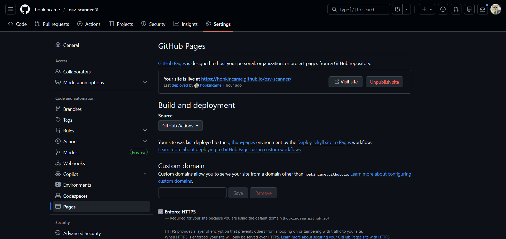

# How to Contribute

We'd love to accept your patches and contributions to this project. There are
just a few small guidelines you need to follow.

## Contributor License Agreement

Contributions to this project must be accompanied by a Contributor License
Agreement. You (or your employer) retain the copyright to your contribution;
this simply gives us permission to use and redistribute your contributions as
part of the project. Head over to <https://cla.developers.google.com/> to see
your current agreements on file or to sign a new one.

You generally only need to submit a CLA once, so if you've already submitted one
(even if it was for a different project), you probably don't need to do it
again.

## Code reviews

All submissions, including submissions by project members, require review. We
use GitHub pull requests for this purpose. Consult
[GitHub Help](https://help.github.com/articles/about-pull-requests/) for more
information on using pull requests.

## Community Guidelines

This project follows
[Google's Open Source Community Guidelines](https://opensource.google.com/conduct/).

## Contributing documentation

Please review the documentation [README](docs/README.md) for more information about contributing to documentation.

## Contributing code

### Prerequisites

Install:

1. [Go](https://go.dev/) 1.19+, use `go version` to check.
2. [GoReleaser](https://goreleaser.com/) (Optional, only if you want reproducible builds).

> **Note**
>
> The scripts within `/scripts` expect to be run from the root of the repository

### Building

#### Build using only `go`

Run the following in the project directory:

```shell
./scripts/build.sh
```

Produces `osv-scanner` binary in the project directory.

#### Build using `goreleaser`

Run the following in the project directory:

```shell
./scripts/build_snapshot.sh
```

See GoReleaser [documentation](https://goreleaser.com/cmd/goreleaser_build/) for build options.

You can also reproduce the downloadable builds by checking out the specific tag and running `goreleaser build`,
using the same Go version as the one used during the actual release (see goreleaser workflows).

### Running tests

To run tests:

```shell
./scripts/run_tests.sh
```

To get consistent test results, please run with `GOTOOLCHAIN=go<go version in go.mod>`.

By default, tests that require additional dependencies beyond the go toolchain are skipped.
Enable these tests by setting the env variable `TEST_ACCEPTANCE=true`.

You can generate an HTML coverage report by running:

```shell
./scripts/generate_coverage_report.sh
```

You can regenerate snapshots by setting `UPDATE_SNAPS=true` when running tests:

```shell
UPDATE_SNAPS=true ./scripts/run_tests.sh
```

### Linting

To lint your code, run

```shell
./scripts/run_lints.sh
```

## Contributing documentation

Please follow these steps to successfully contribute documentation.

1. Fork the repository.
2. Make desired documentation changes.
3. Preview the changes by spinning up a GitHub page for your fork, building from your working branch.
   - On your fork, go to the settings tab and then the GitHub page settings. Sample URL: https://github.com/{your-github-profile}/osv-scanner/settings/pages
   - Under "Build and deployment" select "Build from branch"
   - Set the branch to your working branch
   - Set the github page to build from the "/docs" folder
   - Hit save and wait for your site to build
   - Once it is ready, click the link and preview the docs



4. If you are satisfied with the changes, open a PR.
5. In the PR, link to your fork's GitHub page, so we can preview the changes.

For information on how to run the documentation locally, please see our [documentation readme](https://github.com/google/osv-scanner/blob/main/docs/README.md/#running-docs-locally).
