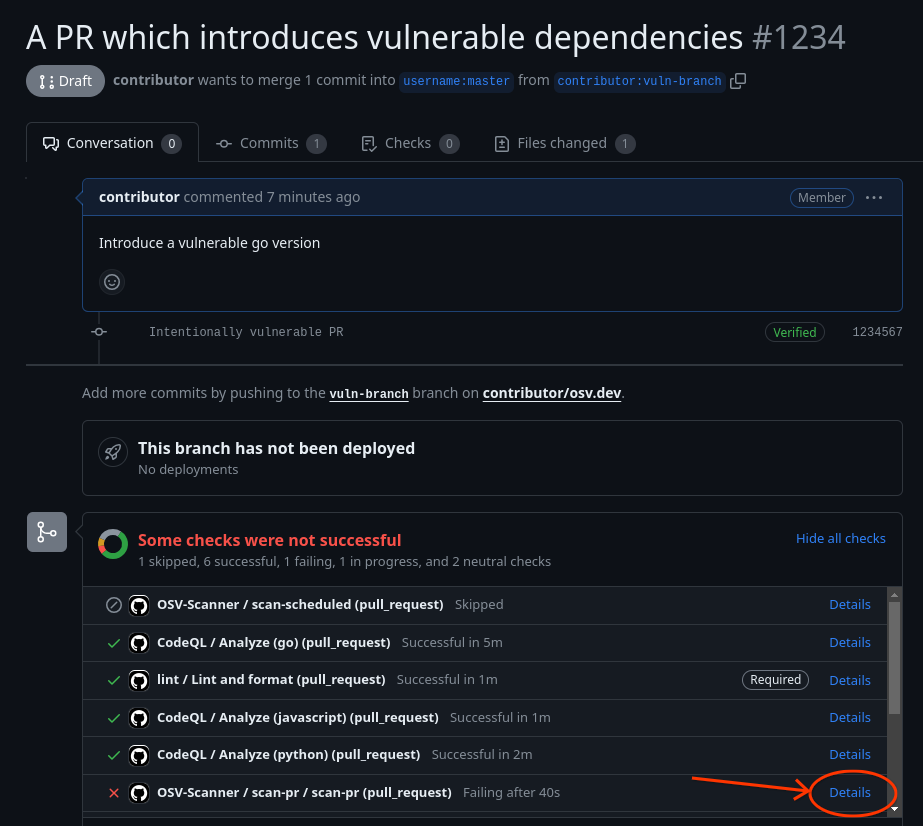
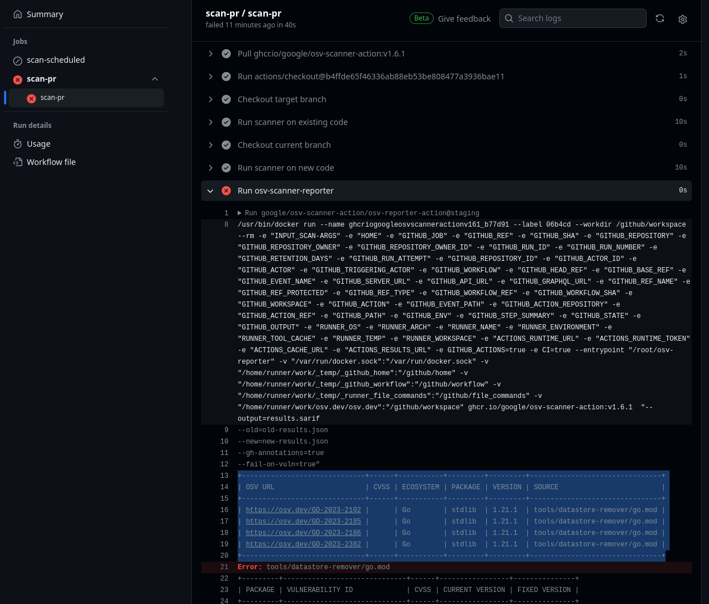
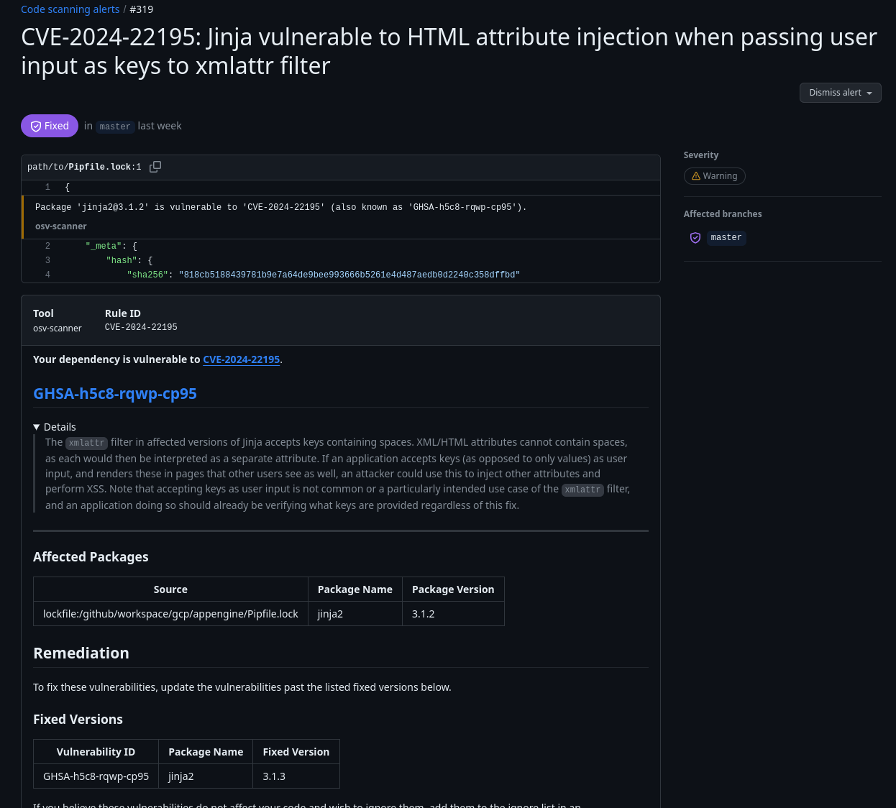

# GitHub Action

{: .no_toc }

<details open markdown="block">
  <summary>
    Table of contents
  </summary>
  {: .text-delta }
- TOC
{:toc}
</details>

OSV-Scanner is available as a CI/CD Action. We currently offer two different reusable workflows for Github:

1. A workflow that triggers a scan with each [pull request](./github-action.md#scan-on-pull-request) and will only report new vulnerabilities introduced through the pull request.
2. A workflow that performs a full vulnerability scan, which can be configured to scan on pushes or a [regular schedule](./github-action.md#scheduled-scans). The full vulnerability scan can also be configured to run [on release](./github-action.md#scan-on-release) to prevent releasing with known vulnerabilities in dependencies.

Currently there is no prebuilt workflows for other platforms, but we welcome any contributions for this!

## Scan on pull request

Scanning your project on each pull request can help you keep vulnerabilities out of your project. This GitHub Action compares a vulnerability scan of the target branch to a vulnerability scan of the feature branch, and will fail if there are new vulnerabilities introduced through the feature branch. You may choose to [prevent merging](https://docs.github.com/en/repositories/configuring-branches-and-merges-in-your-repository/managing-protected-branches/about-protected-branches#require-status-checks-before-merging) if new vulnerabilities are introduced, but by default the check will only warn users.

### Instructions

In your project repository, create a new file `.github/workflows/osv-scanner-pr.yml`.

Include the following in the `osv-scanner-pr.yml` file:

```yml
name: OSV-Scanner PR Scan

# Change "main" to your default branch if you use a different name, i.e. "master"
on:
  pull_request:
    branches: [main]
  merge_group:
    branches: [main]

permissions:
  # Require writing security events to upload SARIF file to security tab
  security-events: write
  # Only need to read contents
  contents: read

jobs:
  scan-pr:
    uses: "google/osv-scanner-action/.github/workflows/osv-scanner-reusable.yml@v1.7.1"
```

### View results

Results may be viewed by clicking on the details of the failed action, either from your project's actions tab or directly on the PR.

|                                                 OSV-Scanner PR Check Failing                                                  |                         PR Scanning Check Output                          |
| :---------------------------------------------------------------------------------------------------------------------------: | :-----------------------------------------------------------------------: |
|  |  |

Results are also included in GitHub annotations on the "Files changed" tab for the PR.

## Scheduled scans

Regularly scanning your project for vulnerabilities can alert you to new vulnerabilities in your dependency tree. This GitHub Action will scan your project on a set schedule and report all known vulnerabilities. If vulnerabilities are found the action will return a failed status.

### Instructions

In your project repository, create a new file `.github/workflows/osv-scanner-scheduled.yml`.

Include the following in the `osv-scanner-scheduled.yml` file:

```yml
name: OSV-Scanner Scheduled Scan

on:
  schedule:
    - cron: "30 12 * * 1"
  # Change "main" to your default branch if you use a different name, i.e. "master"
  push:
    branches: [main]

permissions:
  # Require writing security events to upload SARIF file to security tab
  security-events: write
  # Only need to read contents
  contents: read

jobs:
  scan-scheduled:
    uses: "google/osv-scanner-action/.github/workflows/osv-scanner-reusable.yml@v1.7.1"
```

As written, the scanner will run on 12:30 pm UTC every Monday, and also on every push to the main branch. You can change the schedule by following the instructions [here](https://docs.github.com/en/actions/using-workflows/events-that-trigger-workflows#schedule).

### View results

Maintainers can review results of the scan by navigating to their project's `security > code scanning` tab. Vulnerability details can also be viewed by clicking on the details of the failed action.

|                          OSV-Scanner Code Scanning Tab                           |                                 Code Scanning Detailed Entry                                  |
| :------------------------------------------------------------------------------: | :-------------------------------------------------------------------------------------------: |
|  |  |

## Scan on release

Here is a example of blocking on release, though the actual implementation will heavily depend on your specific release process.

```yml
name: Go Release Process

on:
  push:
    tags:
      - "*" # triggers only if push new tag version, like `0.8.4` or else

permissions:
  contents: read # to fetch code (actions/checkout)

jobs:
  osv-scan:
    uses: google/osv-scanner/.github/workflows/osv-scanner-reusable.yml
    with:
      # Only scan the top level go.mod file without recursively scanning directories since
      # this is pipeline is about releasing the go module and binary
      scan-args: |-
        --skip-git
        ./
    permissions:
      # Require writing security events to upload SARIF file to security tab
      security-events: write
  tests:
    name: Run unit tests
    ...
  release:
    needs: # Needs both tests and osv-scan to pass
      - tests
      - osv-scan
    # Your actual release steps
    steps:
      ...
```

### View results

Results may be viewed by clicking on the details of the failed release action from the action tab.

## Customization

The GitHub Actions have the following optional inputs:

- `scan-args`: This value is passed to `osv-scanner` CLI after being split by each line. See the [usage](./usage) page for the available options. The `--format` and `--output` flags are already set by the reusable workflow and should not be overridden here.
  Default:
  ```bash
    --recursive # Recursively scan subdirectories
    --skip-git=true # Skip commit scanning to focus on dependencies
    ./ # Start the scan from the root of the repository
  ```
- `results-file-name`: This is the name of the final SARIF file uploaded to Github.
  Default: `results.sarif`
- `download-artifact`: Optional artifact to download for scanning. Can be used if you need to do some preprocessing to prepare the lockfiles for scanning. If the file names in the artifact are not standard lockfile names, make sure to add custom scan-args to specify the lockfile type and path (see [specify lockfiles](./usage#specify-lockfiles)).
- `upload-sarif`: Whether to upload the results to Security > Code Scanning. Defaults to `true`.
- `fail-on-vuln`: Whether to fail the workflow when a vulnerability is found. Defaults to `true`.

<details markdown="block">
<summary>
Examples
</summary>

#### Scan specific lockfiles

```yml
jobs:
  scan-pr:
    uses: "google/osv-scanner-action/.github/workflows/osv-scanner-reusable.yml@v1.7.1"
    with:
      scan-args: |-
        --lockfile=./path/to/lockfile1
        --lockfile=requirements.txt:./path/to/python-lockfile2.txt
```

#### Default arguments

```yml
jobs:
  scan-pr:
    uses: "google/osv-scanner-action/.github/workflows/osv-scanner-reusable.yml@v1.7.1"
    with:
      scan-args: |-
        --recursive
        --skip-git=true
        ./
```

#### Using download-artifact input to support preprocessing

```yml
jobs:
  extract-deps:
    name: Extract Dependencies
    # ...
    steps:
      # ... Steps to extract your dependencies
      - name: "upload osv-scanner deps" # Upload the deps
        uses: actions/upload-artifact@v4
        with:
          name: converted-OSV-Scanner-deps
          path: osv-scanner-deps.json
          retention-days: 2
  vuln-scan:
    name: Vulnerability scanning
    # makes sure the extraction step is completed before running the scanner
    needs: extract-deps
    uses: "google/osv-scanner-action/.github/workflows/osv-scanner-reusable.yml@v1.7.1"
    with:
      # Download the artifact uploaded in extract-deps step
      download-artifact: converted-OSV-Scanner-deps
      # Scan only the file inside the uploaded artifact
      scan-args: |-
        --lockfile=osv-scanner:osv-scanner-deps.json
    permissions:
      # Needed to upload the SARIF results to code-scanning dashboard.
      security-events: write
      contents: read
```

</details>
