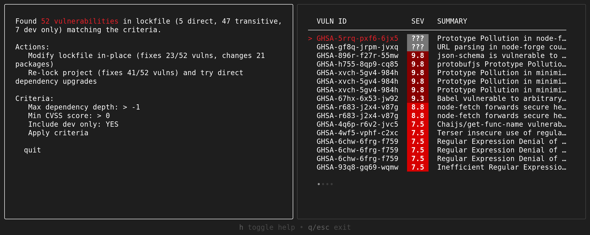
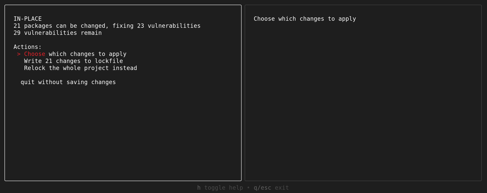
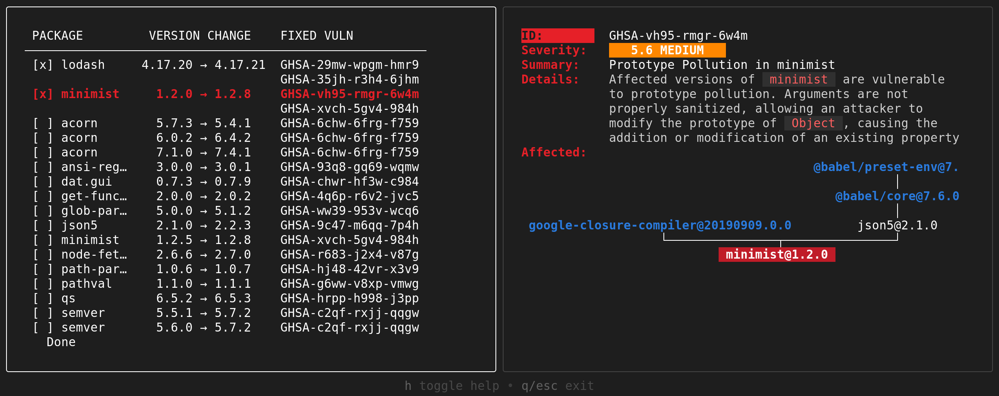
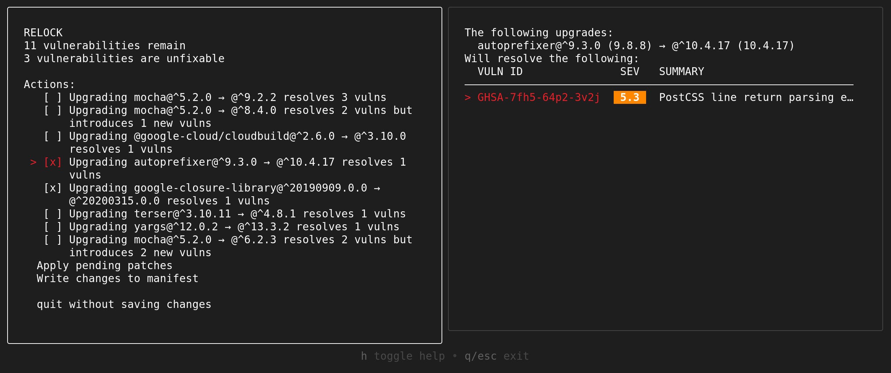

# Guided Remediation

Experimental
{: .label }

{: .no_toc }

<details open markdown="block">
  <summary>
    Table of contents
  </summary>
  {: .text-delta }
- TOC
{:toc}
</details>

Guided remediation (`osv-scanner fix`) aims to help developers with fixing the high number of known vulnerabilities in dependencies typically reported by vulnerability scanners by providing a small number of actionable steps.

This tool provides several options to users for how to prioritise and remediate their vulnerabilities, with easy to understand information on how we arrived at these options and how to compare them. This includes features such as:

- Resolution and analysis of the entire transitive graph (leveraging [deps.dev](https://deps.dev)) to determine the minimal changes required to remove vulnerabilities.
- Prioritising direct dependency upgrades by the total number of transitive vulnerabilities fixed.
- Prioritising vulnerabilities by dependency depth, severity, and whether or not to care about dev-only dependencies.
- Modification of package manifest and lockfiles (e.g. `package.json`/`package-lock.json`) to fix vulnerabilities.
- Different strategies with different risk/reward ratios (e.g. in-place fixes vs relocking).

{: .highlight }
Currently, only npm `package.json` manifests and `package-lock.json` lockfiles are supported.

{: .note }
This feature is experimental and might change or be removed with only a minor version update.

## Basic usage

To fix as many vulnerabilities as possible in your `package-lock.json` file [in-place](#in-place-lockfile-remediation), you can use the following command:

```bash
osv-scanner fix --non-interactive --strategy=in-place -L path/to/package-lock.json
```

<details markdown="1">
<summary><b>Sample in-place output</b></summary>

{: .highlight }
The output format might change with minor version updates.

```
Scanning path/to/package-lock.json...
Found 55 vulnerabilities matching the filter
Can fix 25/55 matching vulnerabilities by changing 21 dependencies
UPGRADED-PACKAGE: lodash,4.17.20,4.17.21
UPGRADED-PACKAGE: minimist,1.2.0,1.2.8
UPGRADED-PACKAGE: ws,6.2.1,6.2.3
UPGRADED-PACKAGE: ws,7.1.2,7.5.10
UPGRADED-PACKAGE: acorn,5.7.3,5.4.1
UPGRADED-PACKAGE: acorn,6.0.2,6.4.2
UPGRADED-PACKAGE: acorn,7.1.0,7.4.1
UPGRADED-PACKAGE: ansi-regex,3.0.0,3.0.1
UPGRADED-PACKAGE: dat.gui,0.7.3,0.7.9
UPGRADED-PACKAGE: get-func-name,2.0.0,2.0.2
UPGRADED-PACKAGE: glob-parent,5.0.0,5.1.2
UPGRADED-PACKAGE: json5,2.1.0,2.2.3
UPGRADED-PACKAGE: minimist,1.2.5,1.2.8
UPGRADED-PACKAGE: node-fetch,2.6.6,2.7.0
UPGRADED-PACKAGE: path-parse,1.0.6,1.0.7
UPGRADED-PACKAGE: pathval,1.1.0,1.1.1
UPGRADED-PACKAGE: qs,6.5.2,6.5.3
UPGRADED-PACKAGE: semver,5.5.1,5.7.2
UPGRADED-PACKAGE: semver,5.6.0,5.7.2
UPGRADED-PACKAGE: semver,6.3.0,6.3.1
UPGRADED-PACKAGE: y18n,4.0.0,4.0.3
FIXED-VULN-IDS: GHSA-29mw-wpgm-hmr9,GHSA-35jh-r3h4-6jhm,GHSA-3h5v-q93c-6h6q,GHSA-3h5v-q93c-6h6q,GHSA-4q6p-r6v2-jvc5,GHSA-6chw-6frg-f759,GHSA-6chw-6frg-f759,GHSA-6chw-6frg-f759,GHSA-6fc8-4gx4-v693,GHSA-6fc8-4gx4-v693,GHSA-93q8-gq69-wqmw,GHSA-9c47-m6qq-7p4h,GHSA-c2qf-rxjj-qqgw,GHSA-c2qf-rxjj-qqgw,GHSA-c2qf-rxjj-qqgw,GHSA-c4w7-xm78-47vh,GHSA-chwr-hf3w-c984,GHSA-g6ww-v8xp-vmwg,GHSA-hj48-42vr-x3v9,GHSA-hrpp-h998-j3pp,GHSA-r683-j2x4-v87g,GHSA-vh95-rmgr-6w4m,GHSA-ww39-953v-wcq6,GHSA-xvch-5gv4-984h,GHSA-xvch-5gv4-984h
REMAINING-VULNS: 30
UNFIXABLE-VULNS: 30
Rewriting path/to/package-lock.json...
```

</details>

Alternatively, to potentially resolve even more vulnerabilities with larger (potentially breaking) changes, you can [regenerate your lockfile and update your direct dependencies](#relock-and-relax-direct-dependency-remediation) with the following command:

```bash
osv-scanner fix --non-interactive --strategy=relock -M path/to/package.json -L path/to/package-lock.json
```

<details markdown="1">
<summary><b>Sample relock output</b></summary>

{: .highlight }
The output format might change with minor version updates.

```
Resolving path/to/package.json...
Found 12 vulnerabilities matching the filter
Can fix 9/12 matching vulnerabilities by changing 6 dependencies
UPGRADED-PACKAGE: mocha,^5.2.0,^9.2.2
UPGRADED-PACKAGE: @google-cloud/cloudbuild,^2.6.0,^4.5.0
UPGRADED-PACKAGE: autoprefixer,^9.3.0,^10.4.20
UPGRADED-PACKAGE: google-closure-library,^20190909.0.0,^20200315.0.0
UPGRADED-PACKAGE: terser,^3.10.11,^4.8.1
UPGRADED-PACKAGE: yargs,^12.0.2,^13.3.2
FIXED-VULN-IDS: GHSA-4wf5-vphf-c2xc,GHSA-7fh5-64p2-3v2j,GHSA-7v5v-9h63-cj86,GHSA-f8q6-p94x-37v3,GHSA-h755-8qp9-cq85,GHSA-p9pc-299p-vxgp,GHSA-vh5w-fg69-rc8m,GHSA-vh95-rmgr-6w4m,GHSA-xvch-5gv4-984h
REMAINING-VULNS: 3
UNFIXABLE-VULNS: 3
Rewriting path/to/package.json...
Shelling out to regenerate lockfile...
Executing `/usr/bin/npm install --package-lock-only`...
```

</details>

{: .warning }
The subcommand will modify your manifest and lockfile. Make sure you commit or backup your files before running.

{: .note }
The subcommand will not reinstall your `node_modules/` - you will need to manually run `npm ci` to install dependencies.

If you wish to remediation only specific vulnerabilities, you may specify OSV IDs using the `--vulns` flag. [See all remediation flags](#remediation-flags).

## Scripted usage

The `--non-interactive` mode, in combination with [other flags](#remediation-flags), can be used in scripts to automatically apply and test remediation patches.

Check out our [sample Python script](https://github.com/google/osv-scanner/blob/main/scripts/examples/auto_guided_remediation.py) that uses `osv-scanner fix` to remediate as many vulnerabilities as possible without failing your project's `npm run test`.

## Interactive mode

Interactive mode provides a step-by-step process to understand and fix vulnerabilities in your project.

To run it, you can use the following command:

```bash
osv-scanner fix -M path/to/package.json -L path/to/package-lock.json
```

{: .warning }
The subcommand will modify your manifest and lockfile. Make sure you commit or backup your files before running.

The command will launch the Guided Remediation TUI and begin scanning your manifest and lockfile for vulnerabilities. Use the arrow keys to navigate menu items and the `ENTER` key to select. `TAB` can be used to switch to and from the information panel of each option.



{: .highlight }

> The initial screen allows you to change the vulnerability selection criteria. Each correspond to a [vulnerability selection flag](#vulnerability-selection):
>
> - Max dependency depth: `--max-depth`
> - Min CVSS score: `--min-severity`
> - Exclude dev only: `--ignore-dev`

From the first results screen, you can select which of the two remediation strategies to attempt.

## In-place lockfile remediation

'In-place' remediation involves replacing vulnerable versions of packages in your lockfile with non-vulnerable versions, while still respecting the existing constraints for that dependency. This approach is usually less risky, but will often fix less vulnerabilities than the [relock strategy](#relock-and-relax-direct-dependency-remediation).

Selecting the "Modify lockfile in place" option will bring you to the in-place information page. From here, you can see which vulnerabilities can and cannot be resolved by this strategy. By default, every possible in-place patch will be chosen to be applied. You may instead choose which subset of patches you wish to apply.





If you wish to apply the proposed in-place patches, select the "Write" option to update your lockfile with the new dependency versions.

{: .note }
Writing these changes will not reinstall your dependencies. You'll need to run `npm ci` (or equivalent) separately.

## Relock and relax direct dependency remediation

Relocking recomputes your entire dependency graph based on your manifest file, taking the newest possible versions of all your required packages. Doing so will often allow for constraints on vulnerable packages to be unblocked and thus able to be remediated. However, relocking may cause a large number of changes to your dependency graph, which potentially carries a larger risk of breakages.

Selecting the "Relock" option will bring you to the relock information page. Here, you can see which vulnerabilities are present after relocking.

In addition to relocking, it may be possible to further remove vulnerabilities by bumping the required version constraints of your direct dependencies. You may choose to apply these patches by selecting them on the relock page then choosing the "Apply pending patches" option. The dependency graph will then be recomputed and you may continue to select more options.



The relaxation patches are presented in order of effectiveness, with patches that resolve the most vulnerabilities with the least amount of dependency change shown first.

If you wish to apply your current relock & relaxation changes, select the "Write" option to update your manifest file with the new requirements and regenerate your lockfile (if provided).

{: .note }

> The `package-lock.json` file is regenerated by first deleting the existing `package-lock.json` and `node_modules/` directory, then running `npm install --package-lock-only`. This recreates the lockfile but does not install the `node_modules/` dependencies. Run `npm ci` separately to install the dependencies.
>
> The `--relock-cmd` flag can be used to change the executed install command.

## Remediation flags

The `fix` subcommand has a number of flags to allow you to control which vulnerabilities and patches may be considered during remediation.

### Non-interactive flags

The following flags may be used when running in non-interactive mode only:

- `--strategy=` [`in-place`](#in-place-lockfile-remediation) OR [`relock`](#relock-and-relax-direct-dependency-remediation): Which remediation strategy to use.
- `--apply-top=<value>`: Specifies the maximum number of patches to apply. Patches are chosen in the same order as they would appear in the interactive mode.

  For example, `--apply-top=1` will only apply one patch, and `--apply-top=2` would apply the two best compatible patches. This flag is particularly useful when scripting to test the outcome of specific patches. Setting `--apply-top=-1` will apply every possible patch (default behavior).

### Vulnerability selection

The following flags may be used to filter which vulnerabilities will be selected for remediation:

- `--max-depth=<value>`: The maximum dependency depth to consider vulnerabilities from.

  For example, `--max-depth=1` will only consider vulnerabilities affecting direct dependencies, while `--max-depth=2` will consider up to the direct dependencies of your direct dependencies. Setting `--max-depth=-1` will consider all dependencies, regardless of depth.

- `--min-severity=<value>`: The minimum CVSS score of vulnerabilities to consider.

  For example, `--min-severity=7.5` will consider only vulnerabilities with CVSS a score of 7.5 and above. If the OSV record for the vulnerability does not have a CVSS score, it will **not** be excluded.

- `--ignore-dev`: Whether to exclude vulnerabilities from dependencies that are only used in `devDependencies`.
- `--ignore-vulns=<comma-separated list of IDs>`: A list of OSV IDs to exclude from consideration.
- `--vulns=<comma-separated list of IDs>`: An explicit list of OSV IDs that should exclusively be considered, as long as the other criteria are satisfied.

A vulnerability is only considered if it satisfies all the conditions set by these flags.

### Dependency upgrade options

The following flag may be used to limit the patches allowed for your dependencies:

- `--upgrade-config=<[package-name:]level>` Sets the maximum upgrade level allowed for a package. Can be repeated for multiple packages.

  `level` is the SemVer component to allow updates to, can be one of `major`, `minor`, `patch`, or `none`. e.g. If a package was at version `1.2.3`

  - `major` allows for updates to any version `>=1.2.3`
  - `minor` allows for updates `>=1.2.3, <2.0.0`
  - `patch` allows for updates `>=1.2.3, <1.3.0`
  - `none` disallows any updates

  If `package-name:` is omitted, `level` is applied to all packages. The specific `package-name:level` will take precedence over the general `level` (e.g. specifying both `minor` `pkg:none` will use `none` as the allowed level for `pkg`).

  Default behaviour is `--upgrade-config=major`.

  Example usage:

  - `--upgrade-config=minor` - disallow any patches that would bump a major version of any package.
  - `--upgrade-config=foo:minor` - disallow any patches that bumps package `foo` by a major version. Other packages may receive major version-updating patches.
  - `--upgrade-config=none --upgrade-config=foo:patch` - only allow patches to package `foo`, and only allow changes to `foo`'s SemVer patch level.

### Data source

By default, we use the [deps.dev API](https://docs.deps.dev/api/) to find version and dependency information of packages during remediation.

If instead you'd like to use your ecosystem's native registry API (e.g. `https://registry.npmjs.org`), you can use the `--data-source=native` flag. `osv-scanner fix` will attempt to use the authentication specified by the native tooling (e.g. `npm config`)

{: .highlight }
If your project uses mirrored or private registries, you will need to use `--data-source=native`

{: .note }

> The subcommand caches the requests it makes in `package.json.resolve.deps` (deps.dev) and `package.json.resolve.npm` (native npm).
>
> The native npm cache will store the addresses of private registries used, though not any authentication information.

### Offline Vulnerability Database

The `fix` subcommand supports the `--experimental-offline-vulnerabilities` and `--experimental-download-offline-databases` flags.

For more information, see [Offline Mode](./offline-mode.md).

## Known issues

- The subcommand does not use the `osv-scanner.toml` configuration. Use the `--ignore-vulns` flag instead.
- The subcommand does not group aliases of the same vulnerabilities together.
- Unique vulnerabilities are counted differently with `fix --strategy=relock` versus with `fix --strategy=in-place` and with `scan`. `scan` will count the same OSV ID affecting two different package versions separately, whereas `fix --strategy=relock` will count this as one vulnerability.

  e.g. if `OSV-123-456` affects both `foo@1.0.0` and `foo@2.0.0` in your project, `scan` and `fix --strategy=in-place` will treat this as two distinct vulnerabilities, while `fix --strategy=relock` will treat this as only one.

### npm

- Non-registry dependencies (local paths, URLs, Git, etc.) are not evaluated.
- `peerDependencies` are not properly considered during dependency resolution (treated as if using `--legacy-peer-deps`).
- `overrides` are ignored during dependency resolution.

#### Workspaces

Remediation in npm `workspaces` is only partially supported:

- In-place updates should function correctly on the workspace `package-lock.json`.
- Dependency relaxation can change dependencies in the `package.json` file being being scanned. This means only dependencies declared in the root package can be changed.
  - You can remediate the individual `package.json` files of each workspace, but this will be unaware of any packages or constraints caused by sibling workspaces.
- The `node_modules/` in workspaces are not deleted when relocking, which may impact the resulting dependency graph when running `npm install`.
- Each workspace package is considered dependency depth 1 from the root workspace.
