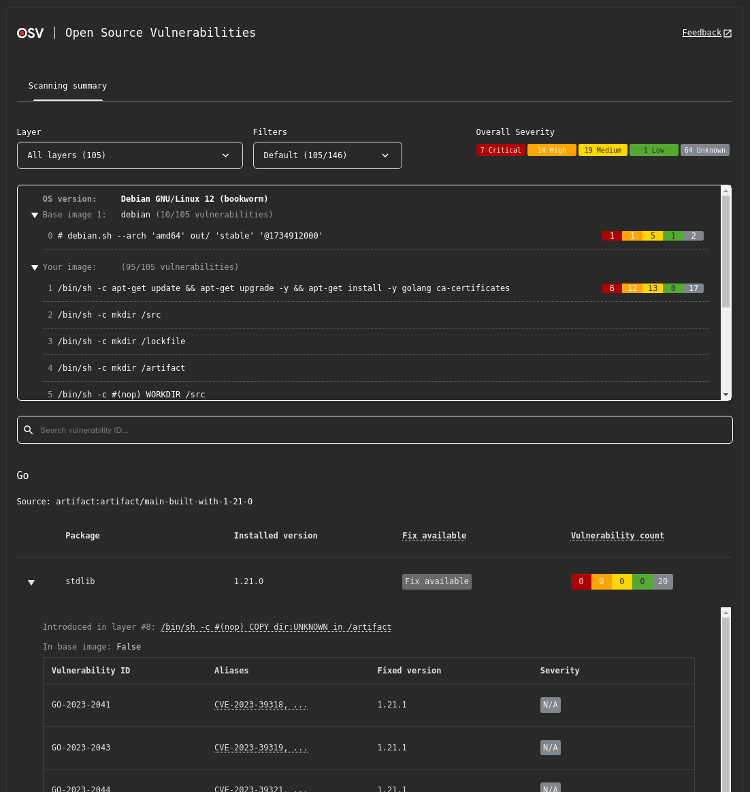

# Output

{: .no_toc }

<details open markdown="block">
  <summary>
    Table of contents
  </summary>
  {: .text-delta }
- TOC
{:toc}
</details>

## Explanation of output data

For every vulnerability found, OSV-Scanner will display the following information:

- OSV URL: Link to the osv.dev entry for the vulnerability
- CVSS: CVSS v2 or v3, calculated from the [severity[].score](https://ossf.github.io/osv-schema/#severity-field) field.
- Ecosystem: Ecosystem associated with the package
- Package: Package name
- Version: Package version
- Fixed Version: The version where the vulnerability is fixed, if available. If no fix is available, this will be shown as `--`.
- Source: Path to the sbom or lockfile where the package originated

And if you are performing layer scanning, osv-scanner additionally returns:

- Layer where a package was first introduced
- Layer history and commands
- Base images the image is based on
- OS/Distro the container is running on

## Output formats

You can control the format used by the scanner to output results with the `--format` flag.

### Table (Default)

The default format, which outputs the results as a human-readable table.

```bash
osv-scanner scan --format table your/project/dir
```

<details markdown="1">
<summary><b>Sample table output</b></summary>

```bash
Total 2 packages affected by 2 known vulnerabilities (1 Critical, 1 High, 0 Medium, 0 Low, 0 Unknown) from 2 ecosystems.
1 vulnerability can be fixed.

╭─────────────────────────────────────┬──────┬───────────┬──────────────────────────┬───────────────┬─────────┬────────────────────╮
│ OSV URL                             │ CVSS │ ECOSYSTEM │  PACKAGE                 │ FIXED VERSION │ VERSION │ SOURCE             │
├─────────────────────────────────────┼──────┼───────────┼──────────────────────────┼───────────────┼─────────┼────────────────────┤
│ https://osv.dev/GHSA-c3h9-896r-86jm │ 8.6  │ Go        │ github.com/gogo/protobuf │ 1.3.2         │ 1.3.1   │ path/to/go.mod     │
│ https://osv.dev/GHSA-m5pq-gvj9-9vr8 │ 7.5  │ crates.io │ regex                    │ --            │ 1.3.1   │ path/to/Cargo.lock │
╰─────────────────────────────────────┴──────┴───────────┴──────────────────────────┴───────────────┴─────────┴────────────────────╯
```

If the 'Fixed Version' column is empty or shows `--`, it means there is currently no fix for this vulnerability.

</details>

---

### Markdown Table

```bash
osv-scanner scan --format markdown your/project/dir
```

<details markdown="1">
<summary><b>Sample markdown output</b></summary>

**Raw output:**

```
Total 2 packages affected by 2 known vulnerabilities (1 Critical, 1 High, 0 Medium, 0 Low, 0 Unknown) from 2 ecosystems.
1 vulnerability can be fixed.

| OSV URL                            | CVSS | Ecosystem | Package                  | Fixed Version | Version | Source                                                 |
| ---------------------------------- | ---- | --------- | ------------------------ | ------------- | ------- | ------------------------------------------------------ |
| https://osv.dev/GHSA-c3h9-896r-86jm| 8.6  | Go        | github.com/gogo/protobuf | 1.3.2         | 1.3.1   | ../scorecard-check-osv-e2e/go.mod                      |
| https://osv.dev/GHSA-m5pq-gvj9-9vr8| 7.5  | crates.io | regex                    | --            | 1.5.1   | ../scorecard-check-osv-e2e/sub-rust-project/Cargo.lock |
```

**Rendered:**

| OSV URL                             | CVSS | Ecosystem | Package                  | Fixed Version | Version | Source                                                 |
| ----------------------------------- | ---- | --------- | ------------------------ | ------------- | ------- | ------------------------------------------------------ |
| https://osv.dev/GHSA-c3h9-896r-86jm | 8.6  | Go        | github.com/gogo/protobuf | 1.3.2         | 1.3.1   | ../scorecard-check-osv-e2e/go.mod                      |
| https://osv.dev/GHSA-m5pq-gvj9-9vr8 | 7.5  | crates.io | regex                    | --            | 1.5.1   | ../scorecard-check-osv-e2e/sub-rust-project/Cargo.lock |

</details>

---

### HTML

```bash
osv-scanner scan --format html your/project/dir
# OR
osv-scanner scan --serve your/project/dir # Hosts HTML output at localhost port 8000
# Use the --port flag along with --serve to specify a custom port to host the output
```

The HTML output features a lot more interactivity and information compared to terminal only outputs, including:

- Severity breakdown
- Package and ID filtering
- Vulnerability importance filtering
- Full vulnerability advisory entries

And additionally for container image scanning:

- Layer filtering
- Image layer information
- Base image identification

<details markdown="1">
<summary><b>Sample HTML output</b></summary>



</details>

### JSON

JSON output allows you to get all the information osv-scanner found in a machine-readable format.

```bash
osv-scanner scan --format json your/project/dir
```

Outputs the results as a JSON object to stdout, with all other output being directed to stderr - this makes it safe to redirect the output to a file with

```bash
osv-scanner scan --format json -L path/to/lockfile > /path/to/file.json
```

<details markdown="1">
<summary><b>Sample JSON output</b></summary>

```json
{
  "results": [
    {
      "source": {
        "path": "/absolute/path/to/go.mod",
        // One of: lockfile, sbom, git, docker
        "type": "lockfile"
      },
      "packages": [
        {
          "package": {
            "name": "github.com/gogo/protobuf",
            "version": "1.3.1",
            "ecosystem": "Go"
          },
          "vulnerabilities": [
            {
              "id": "GHSA-c3h9-896r-86jm",
              "aliases": ["CVE-2021-3121"]
              // ... Full OSV
            },
            {
              "id": "GO-2021-0053",
              "aliases": ["CVE-2021-3121", "GHSA-c3h9-896r-86jm"]
              // ... Full OSV
            }
          ],
          // Grouping based on aliases, if two vulnerability share the same alias, or alias each other,
          // they are considered the same vulnerability, and is grouped here under the id field.
          "groups": [
            {
              "ids": ["GHSA-c3h9-896r-86jm", "GO-2021-0053"],
              // Call stack analysis is done using the `--experimental-call-analysis` flag
              // and result is matched against data provided by the advisory to check if
              // affected code is actually being executed.
              "experimentalAnalysis": {
                "GO-2021-0053": {
                  "called": false
                }
              }
            }
          ]
        }
      ]
    },
    {
      "source": {
        "path": "/absolute/path/to/Cargo.lock",
        "type": "lockfile"
      },
      "packages": [
        {
          "package": {
            "name": "regex",
            "version": "1.5.1",
            "ecosystem": "crates.io"
          },
          "vulnerabilities": [
            {
              "id": "GHSA-m5pq-gvj9-9vr8",
              "aliases": ["CVE-2022-24713"]
              // ... Full OSV
            },
            {
              "id": "RUSTSEC-2022-0013",
              "aliases": ["CVE-2022-24713"]
              // ... Full OSV
            }
          ],
          "groups": [
            {
              "ids": ["GHSA-m5pq-gvj9-9vr8", "RUSTSEC-2022-0013"]
            }
          ]
        }
      ]
    }
  ]
}
```

</details>

---

### SARIF

```bash
osv-scanner scan --format sarif your/project/dir
```

Outputs the result in the [SARIF](https://sarifweb.azurewebsites.net/) v2.1.0 format. Each vulnerability (grouped by aliases) is a separate rule, and each package containing a vulnerable dependency is a rule violation.
The help text within the SARIF report contains detailed information about the vulnerability and remediation instructions for how to resolve it.

<details markdown="1">
<summary><b>Sample SARIF output</b></summary>

```json
{
  "version": "2.1.0",
  "$schema": "https://json.schemastore.org/sarif-2.1.0.json",
  "runs": [
    {
      "tool": {
        "driver": {
          "informationUri": "https://github.com/google/osv-scanner",
          "name": "osv-scanner",
          "rules": [
            {
              "id": "CVE-2022-24713",
              "shortDescription": {
                "text": "CVE-2022-24713: <advisory summary>"
              },
              "fullDescription": {
                "text": "<Full advisory details>...",
                "markdown": "<Full advisory details>..."
              },
              // Deprecated IDs field contains all alias IDs
              "deprecatedIds": [
                "CVE-2022-24713",
                "RUSTSEC-2022-0013",
                "GHSA-m5pq-gvj9-9vr8"
              ],
              "help": {
                "text": "<Markdown help text>...",
                "markdown": "<Markdown help text>..."
              }
            }
          ],
          "version": "1.4.1"
        }
      },
      "artifacts": [
        {
          "location": {
            "uri": "file:///path/to/sub-rust-project/Cargo.lock"
          },
          "length": -1
        }
      ],
      "results": [
        {
          "ruleId": "CVE-2022-24713",
          "ruleIndex": 0,
          "level": "warning",
          "message": {
            "text": "Package 'regex@1.5.1' is vulnerable to 'CVE-2022-24713' (also known as 'RUSTSEC-2022-0013', 'GHSA-m5pq-gvj9-9vr8')."
          },
          "locations": [
            {
              "physicalLocation": {
                "artifactLocation": {
                  "uri": "file:///path/to/sub-rust-project/Cargo.lock"
                }
              }
            }
          ]
        }
      ]
    }
  ]
}
```

</details>

<details markdown="1">
<summary><b>Sample SARIF Help Text</b></summary>

> **Your dependency is vulnerable to [CVE-2022-24713](https://osv.dev/list?q=CVE-2022-24713)**
> (Also published as: [RUSTSEC-2022-0013](https://osv.dev/vulnerability/RUSTSEC-2022-0013), [GHSA-m5pq-gvj9-9vr8](https://osv.dev/vulnerability/GHSA-m5pq-gvj9-9vr8), ).
>
> {:.no_toc}
>
> ## [RUSTSEC-2022-0013](https://osv.dev/vulnerability/RUSTSEC-2022-0013)
>
> <details>
> <summary>Details</summary>
>
> > Full advisory details...
>
> </details>
>
> {:.no_toc}
>
> ## [GHSA-m5pq-gvj9-9vr8](https://osv.dev/vulnerability/GHSA-m5pq-gvj9-9vr8)
>
> <details>
> <summary>Details</summary>
>
> > Full advisory details...
>
> </details>
>
> ---
>
> {:.no_toc}
>
> ### Affected Packages
>
> | Source                                    | Package Name | Package Version |
> | ----------------------------------------- | ------------ | --------------- |
> | lockfile:/path/to/rust-project/Cargo.lock | regex        | 1.5.1           |
>
> {:.no_toc}
>
> ## Remediation
>
> To fix these vulnerabilities, update the vulnerabilities past the listed fixed versions below.
>
> {:.no_toc}
>
> ### Fixed Versions
>
> | Vulnerability ID    | Package Name | Fixed Version |
> | ------------------- | ------------ | ------------- |
> | GHSA-m5pq-gvj9-9vr8 | regex        | 1.5.5         |
> | RUSTSEC-2022-0013   | regex        | 1.5.5         |
>
> If you believe these vulnerabilities do not affect your code and wish to ignore them, add them to the ignore list in an
> `osv-scanner.toml` file located in the same directory as the lockfile containing the vulnerable dependency.
>
> See the format and more options in our documentation here: https://google.github.io/osv-scanner/configuration/
>
> Add or append these values to the following config files to ignore this vulnerability:
>
> `/path/to/rust-project/osv-scanner.toml`
>
> ```
> [[IgnoredVulns]]
> id = "CVE-2022-24713"
> reason = "Your reason for ignoring this vulnerability"
> ```

</details>

---

### SPDX

```bash
osv-scanner scan --format spdx-2-3 --all-packages your/project/dir
```

Outputs the result in the [SPDX](https://spdx.dev/) v2.3 format. This matches OSV-Scalibr's SPDX output format.

{: .note }
SPDX only supports listing the packages found, and does not include vulnerability information.
However, `osv-scanner` will still exit with a non-zero exit code (`1`) if any vulnerabilities are found.

<details markdown="1">
<summary><b>Sample SPDX output</b></summary>

```json
{
  "spdxVersion": "SPDX-2.3",
  "dataLicense": "CC0-1.0",
  "SPDXID": "SPDXRef-DOCUMENT",
  "name": "SCALIBR-generated SPDX",
  "documentNamespace": "https://spdx.google/uuid-placeholder-0",
  "creationInfo": {
    "creators": ["Tool: SCALIBR"],
    "created": "2025-08-11T02:58:42Z"
  },
  "packages": [
    {
      "name": "main",
      "SPDXID": "SPDXRef-Package-main-uuid-placeholder-1",
      "versionInfo": "0",
      "supplier": "NOASSERTION",
      "downloadLocation": "NOASSERTION",
      "filesAnalyzed": false
    },
    {
      "name": "has-flag",
      "SPDXID": "SPDXRef-Package-has-flag-uuid-placeholder-2",
      "versionInfo": "4.0.0",
      "supplier": "NOASSERTION",
      "downloadLocation": "NOASSERTION",
      "filesAnalyzed": false,
      "sourceInfo": "Identified by the javascript/bunlock extractor from /path/to/bun.lock",
      "externalRefs": [
        {
          "referenceCategory": "PACKAGE-MANAGER",
          "referenceType": "purl",
          "referenceLocator": "pkg:npm/has-flag@4.0.0"
        }
      ]
    },
    {
      "name": "wrappy",
      "SPDXID": "SPDXRef-Package-wrappy-uuid-placeholder-3",
      "versionInfo": "1.0.2",
      "supplier": "NOASSERTION",
      "downloadLocation": "NOASSERTION",
      "filesAnalyzed": false,
      "sourceInfo": "Identified by the javascript/bunlock extractor from /path/to/bun.lock",
      "externalRefs": [
        {
          "referenceCategory": "PACKAGE-MANAGER",
          "referenceType": "purl",
          "referenceLocator": "pkg:npm/wrappy@1.0.2"
        }
      ]
    },
    {
      "name": "league/flysystem",
      "SPDXID": "SPDXRef-Package-league-flysystem-uuid-placeholder-4",
      "versionInfo": "1.0.8",
      "supplier": "NOASSERTION",
      "downloadLocation": "NOASSERTION",
      "filesAnalyzed": false,
      "sourceInfo": "Identified by the php/composerlock extractor from /path/to/composer.lock",
      "externalRefs": [
        {
          "referenceCategory": "PACKAGE-MANAGER",
          "referenceType": "purl",
          "referenceLocator": "pkg:composer/league%2Fflysystem@1.0.8"
        }
      ]
    }
  ],
  "relationships": [
    {
      "spdxElementId": "SPDXRef-DOCUMENT",
      "relatedSpdxElement": "SPDXRef-Package-main-uuid-placeholder-1",
      "relationshipType": "DESCRIBES"
    },
    {
      "spdxElementId": "SPDXRef-Package-main-uuid-placeholder-1",
      "relatedSpdxElement": "SPDXRef-Package-has-flag-uuid-placeholder-2",
      "relationshipType": "CONTAINS"
    },
    {
      "spdxElementId": "SPDXRef-Package-has-flag-uuid-placeholder-2",
      "relatedSpdxElement": "NOASSERTION",
      "relationshipType": "CONTAINS"
    },
    {
      "spdxElementId": "SPDXRef-Package-main-uuid-placeholder-1",
      "relatedSpdxElement": "SPDXRef-Package-wrappy-uuid-placeholder-3",
      "relationshipType": "CONTAINS"
    },
    {
      "spdxElementId": "SPDXRef-Package-wrappy-uuid-placeholder-3",
      "relatedSpdxElement": "NOASSERTION",
      "relationshipType": "CONTAINS"
    },
    {
      "spdxElementId": "SPDXRef-Package-main-uuid-placeholder-1",
      "relatedSpdxElement": "SPDXRef-Package-league-flysystem-uuid-placeholder-4",
      "relationshipType": "CONTAINS"
    },
    {
      "spdxElementId": "SPDXRef-Package-league-flysystem-uuid-placeholder-4",
      "relatedSpdxElement": "NOASSERTION",
      "relationshipType": "CONTAINS"
    }
  ]
}
```

</details>

---

### CycloneDX

```bash
osv-scanner scan --format cyclonedx-1-5 --all-packages your/project/dir
```

Outputs the result in the [CycloneDX](https://cyclonedx.org/) format.

You can also specify cyclonedx 1.4 using `--format cyclonedx-1.4`.

<details markdown="1">
<summary><b>Sample CycloneDX output</b></summary>

```json
{
  "$schema": "http://cyclonedx.org/schema/bom-1.5.schema.json",
  "bomFormat": "CycloneDX",
  "specVersion": "1.5",
  "version": 1,
  "components": [
    {
      "bom-ref": "pkg:composer/league/flysystem@1.0.8",
      "type": "library",
      "name": "league/flysystem",
      "version": "1.0.8",
      "licenses": [],
      "purl": "pkg:composer/league/flysystem@1.0.8"
    },
    {
      "bom-ref": "pkg:npm/has-flag@4.0.0",
      "type": "library",
      "name": "has-flag",
      "version": "4.0.0",
      "licenses": [],
      "purl": "pkg:npm/has-flag@4.0.0"
    },
    {
      "bom-ref": "pkg:npm/wrappy@1.0.2",
      "type": "library",
      "name": "wrappy",
      "version": "1.0.2",
      "licenses": [],
      "purl": "pkg:npm/wrappy@1.0.2"
    }
  ],
  "vulnerabilities": [
    {
      "id": "GHSA-9f46-5r25-5wfm",
      "references": [
        {
          "id": "CVE-2021-32708",
          "source": {}
        }
      ],
      "ratings": [
        {
          "method": "CVSSv3",
          "vector": "CVSS:3.1/AV:N/AC:L/PR:N/UI:N/S:U/C:H/I:H/A:H"
        }
      ],
      "description": "Time-of-check Time-of-use (TOCTOU) Race Condition in league/flysystem",
      "detail": "### Impact\n\nThe whitespace normalisation using in 1.x and 2.x removes any unicode whitespace. Under certain specific conditions this could potentially allow a malicious user to execute code remotely.\n\nThe conditions: \n\n- A user is allowed to supply the path or filename of an uploaded file.\n- The supplied path or filename is not checked against unicode chars.\n- The supplied pathname checked against an extension deny-list, not an allow-list.\n- The supplied path or filename contains a unicode whitespace char in the extension.\n- The uploaded file is stored in a directory that allows PHP code to be executed.\n\nGiven these conditions are met a user can upload and execute arbitrary code on the system under attack.\n\n### Patches\n\nThe unicode whitespace removal has been replaced with a rejection (exception).\n\nThe library has been patched in:\n- 1.x: https://github.com/thephpleague/flysystem/commit/f3ad69181b8afed2c9edf7be5a2918144ff4ea32\n- 2.x: https://github.com/thephpleague/flysystem/commit/a3c694de9f7e844b76f9d1b61296ebf6e8d89d74\n\n### Workarounds\n\nFor 1.x users, upgrade to 1.1.4. For 2.x users, upgrade to 2.1.1.\n",
      "advisories": [
        {
          "url": "https://nvd.nist.gov/vuln/detail/CVE-2021-32708"
        }
      ],
      "published": "2021-06-29T03:13:28Z",
      "updated": "2024-02-16T08:21:35Z",
      "credits": {
        "organizations": []
      },
      "affects": [
        {
          "ref": "pkg:composer/league/flysystem"
        }
      ]
    }
  ]
}
```

</details>

---

## Call analysis

With `--call-analysis` flag enabled, call information will be included in the output.

### Table

In the table output format, call analysis info is used to split output between vulnerabilities that
affects code called by your project, and vulnerabilities that only affect code paths not called by
your code.

```bash
osv-scanner scan --format table --call-analysis your/project/dir
```

<details markdown="1">
<summary><b>Sample table output</b></summary>

```bash
╭─────────────────────────────────────┬──────┬───────────┬─────────────────┬─────────┬────────────────────╮
│ OSV URL                             │ CVSS │ ECOSYSTEM │ PACKAGE         │ VERSION │ SOURCE             │
├─────────────────────────────────────┼──────┼───────────┼─────────────────┼─────────┼────────────────────┤
│ https://osv.dev/GHSA-qc84-gqf4-9926 │ 8.1  │ crates.io │ crossbeam-utils │ 0.6.6   │ path/to/Cargo.lock │
│ https://osv.dev/RUSTSEC-2022-0041   │      │           │                 │         │                    │
│ https://osv.dev/GHSA-43w2-9j62-hq99 │ 9.8  │ crates.io │ smallvec        │ 1.6.0   │ path/to/Cargo.lock │
│ https://osv.dev/RUSTSEC-2021-0003   │      │           │                 │         │                    │
├─────────────────────────────────────┼──────┼───────────┼─────────────────┼─────────┼────────────────────┤
│ Uncalled vulnerabilities            │      │           │                 │         │                    │
├─────────────────────────────────────┼──────┼───────────┼─────────────────┼─────────┼────────────────────┤
│ https://osv.dev/GHSA-xcf7-rvmh-g6q4 │      │ crates.io │ openssl         │ 0.10.52 │ path/to/Cargo.lock │
│ https://osv.dev/RUSTSEC-2023-0044   │      │           │                 │         │                    │
╰─────────────────────────────────────┴──────┴───────────┴─────────────────┴─────────┴────────────────────╯
```

</details>

### JSON

The JSON output will include analysis results for each vulnerability group.

```bash
osv-scanner scan --format json --call-analysis -L path/to/lockfile > /path/to/file.json
```

<details markdown="1">
<summary><b>Sample JSON output</b></summary>

```json
{
  "results": [
    {
      "source": {
        "path": "path/to/Cargo.lock",
        "type": "lockfile"
      },
      "packages": [
        {
          "package": {
            "name": "crossbeam-utils",
            "version": "0.6.6",
            "ecosystem": "crates.io"
          },
          "vulnerabilities": [
            {
              "id": "GHSA-qc84-gqf4-9926",
              "aliases": ["CVE-2022-23639"]
              // ... Full OSV
            },
            {
              "id": "RUSTSEC-2022-0041",
              "aliases": ["GHSA-qc84-gqf4-9926", "CVE-2022-23639"]
              // ... Full OSV
            }
          ],
          "groups": [
            {
              // This vuln has no function info, so no call analysis done
              "ids": ["GHSA-qc84-gqf4-9926", "RUSTSEC-2022-0041"]
            }
          ]
        },
        {
          "package": {
            "name": "memoffset",
            "version": "0.5.6",
            "ecosystem": "crates.io"
          },
          "vulnerabilities": [
            {
              "id": "GHSA-wfg4-322g-9vqv"
              // ... Full OSV
            },
            {
              "id": "RUSTSEC-2023-0045",
              "aliases": ["GHSA-wfg4-322g-9vqv"]
              // ... Full OSV
            }
          ],
          "groups": [
            {
              "ids": ["GHSA-wfg4-322g-9vqv", "RUSTSEC-2023-0045"],
              // RUSTSEC-2023-0045 does have function info, call analysis is performed
              // the vulnerable function is not called
              "experimentalAnalysis": {
                "RUSTSEC-2023-0045": {
                  "called": false
                }
              }
            }
          ]
        },
        {
          "package": {
            "name": "smallvec",
            "version": "1.6.0",
            "ecosystem": "crates.io"
          },
          "vulnerabilities": [
            {
              "id": "GHSA-43w2-9j62-hq99",
              "aliases": ["CVE-2021-25900"]
              // ... Full OSV
            },
            {
              "id": "RUSTSEC-2021-0003",
              "aliases": ["CVE-2021-25900", "GHSA-43w2-9j62-hq99"]
              // ... Full OSV
            }
          ],
          "groups": [
            {
              "ids": ["GHSA-43w2-9j62-hq99", "RUSTSEC-2021-0003"],
              // RUSTSEC-2021-0003 does have function info, call analysis is performed
              // the vulnerable function does get called.
              "experimentalAnalysis": {
                "RUSTSEC-2021-0003": {
                  "called": true
                }
              }
            }
          ]
        }
      ]
    }
  ]
}
```

</details>

## Return Codes

| Exit Code | Reason                                                                                       |
| :-------: | -------------------------------------------------------------------------------------------- |
|    `0`    | Packages were found when scanning, but does not match any known vulnerabilities or findings. |
|    `1`    | Packages were found when scanning, and there are vulnerabilities or findings.                |
|  `1-126`  | Reserved for vulnerability result related errors.                                            |
|   `127`   | General Error.                                                                               |
|   `128`   | No packages found (likely caused by the scanning format not picking up any files to scan).   |
| `129-255` | Reserved for non result related errors.                                                      |
